# Git 课程任务

## 任务概览

- **任务1**: 破冰活动：自我介绍
- **任务2**: 实践项目：构建个人项目

## 任务1: 破冰活动：自我介绍

### 目标

每位参与者提交一份自我介绍。
提交地址：https://github.com/InternLM/Tutorial 的 camp3 分支～

### 要求

1. 命名格式为 `camp3_<id>.md`，其中 `<id>` 是您的报名问卷ID。
2. 文件路径应为 `./data/Git/task/`。
3. 【大家可以叫我】内容可以是 GitHub 昵称、微信昵称或其他网名。
4. 在 GitHub 上创建一个 Pull Request，提供对应的 PR 链接。

#### Step 1: 从InternLM仓库Fork一份自己的仓库
点击`Fork`按钮:
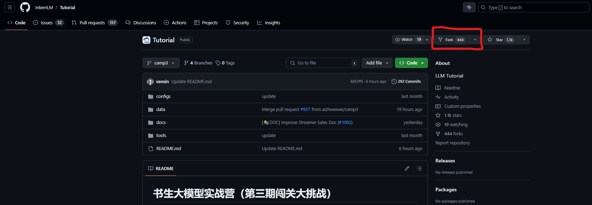

可以更改仓库名称并添加描述，点击 `Create Fork`创建仓库:
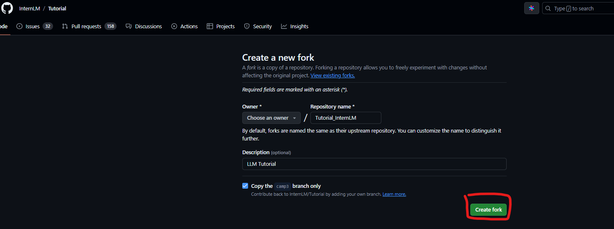

#### Step 2: 拉取仓库到本地
本人使用Github Desktop拉取仓库
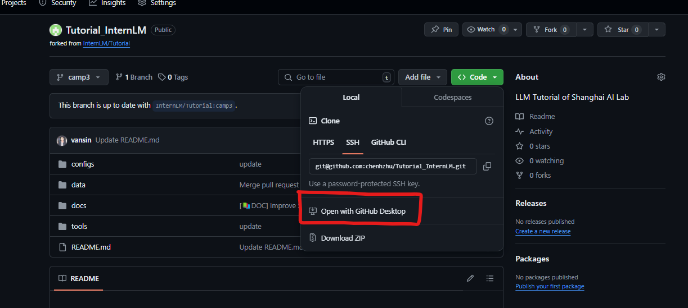

界面如下:
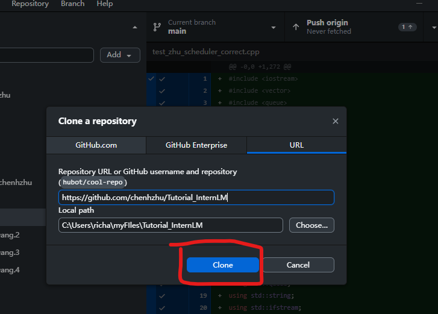

#### Step 3: 添加自我介绍到指定目录
用VScode打开仓库文件夹:
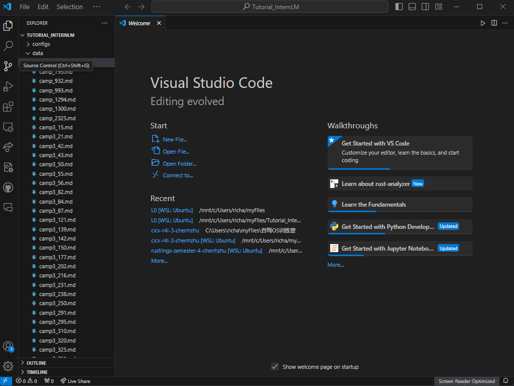

进入到`data/Git/task`目录下创建`camp3_<id>.md` (此处以id=2561为例):
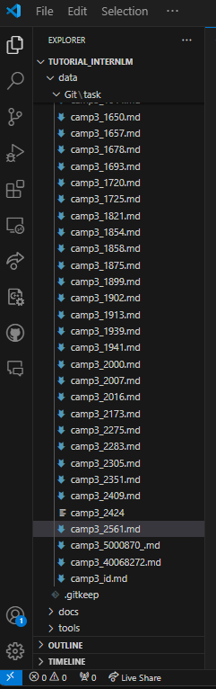

按照模板编辑自我介绍:
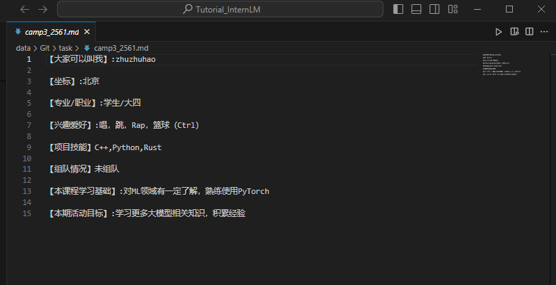

#### Step 4: 提交并推送文件
打开Github Desktop并找到fork的仓库，点击`Commit to camp3`
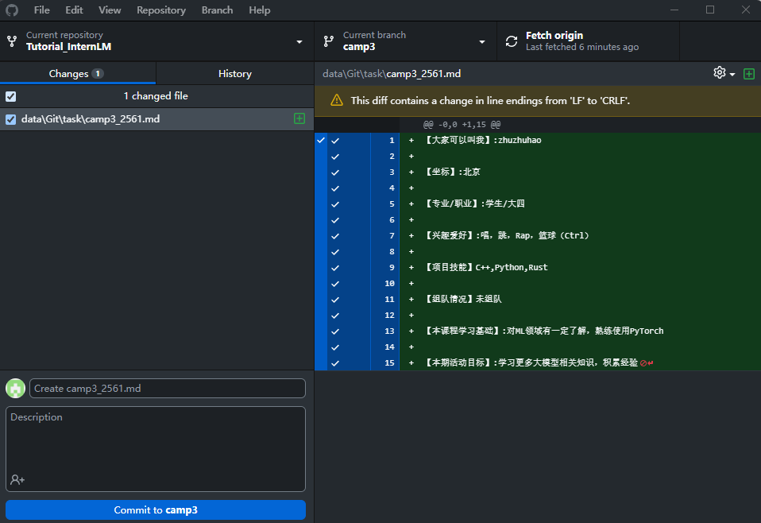

随后点击`Push origin`将自动推送改动到fork的仓库:
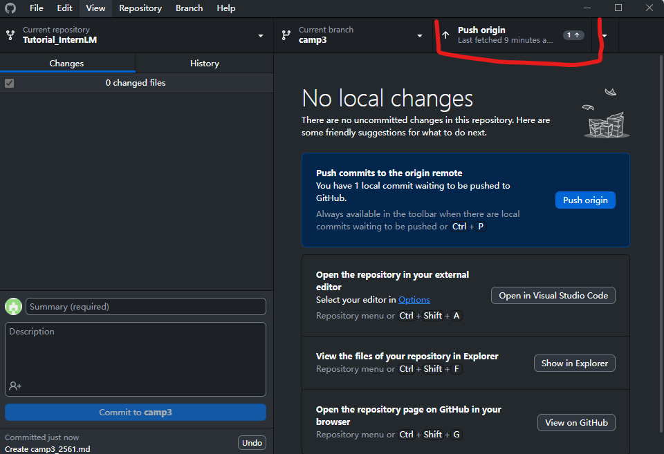

之后打开fork的github repo主页，点击`contribute`出现下拉菜单，再点击`Open pull request`按钮:
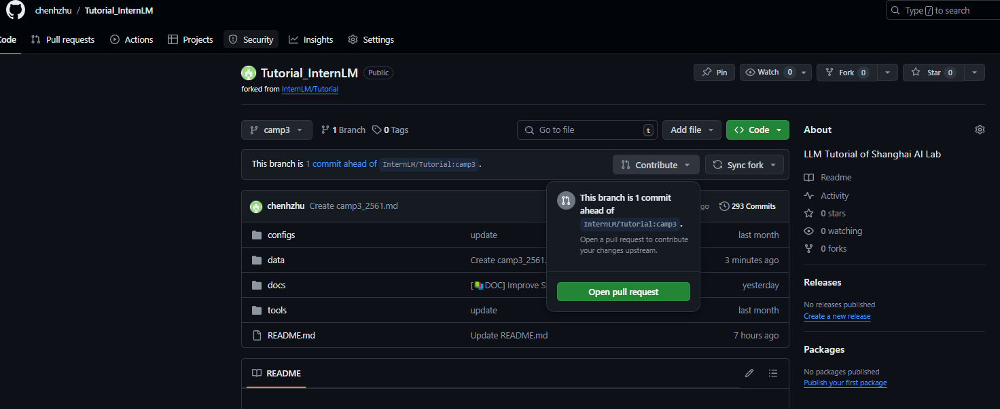

编辑好 Title 和 description 后就可以点击`Create pull request`按钮:
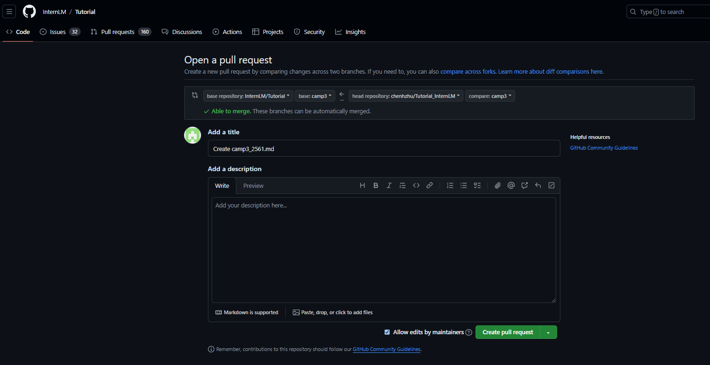

成功界面如下图所示:
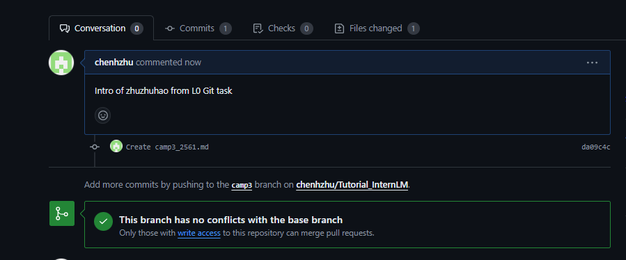

## 任务2: 实践项目：构建个人项目

### 目标

创建一个个人仓库，用于提交笔记、心得体会或分享项目。

### 要求

1. 创建并维护一个公开的大模型相关项目或笔记仓库。
2. 提交作业时，提供您的 GitHub 仓库链接。
3. 如果您不常使用 GitHub，您可以选择其他代码管理平台，如 Gitee，并提交相应的链接。
4. 仓库介绍中添加超链接跳转 [GitHub 仓库](https://github.com/InternLM/Tutorial)（<u>[https://github.com/InternLM/Tutorial](https://github.com/InternLM/Tutorial)</u>）
5. 将此项目报名参加第三期实战营项目评选将解锁 30% A100 和 168 团队算力点资源，报名链接：[https://aicarrier.feishu.cn/wiki/DjY6whCO0inTu2kQN9Cchxgynme](https://aicarrier.feishu.cn/wiki/DjY6whCO0inTu2kQN9Cchxgynme)

#### Step 1: 创建新仓库
登录Github后在右上角的加号键下拉菜单里点击`New repository`按钮:
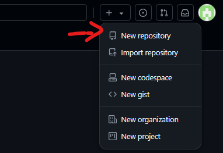

在创建界面中编辑好仓库名字和描述便可点击`Create repository`:
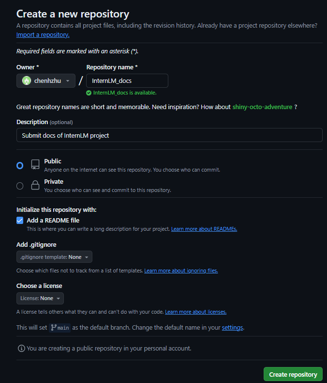

将新创建的仓库通过Github Desktop部署到本地后，就可像编辑上传自我介绍那样编辑仓库里的文件了:

## 闯关材料提交

将Pull Request链接闯关材料提交到以下问卷，助教老师批改后将获得 50 算力点奖励！！！，完成项目申报后请联系浦语小助手（微信ID：InternLM）申请额外的团队项目算力资源～

提交地址：[https://aicarrier.feishu.cn/share/base/form/shrcnZ4bQ4YmhEtMtnKxZUcf1vd](https://aicarrier.feishu.cn/share/base/form/shrcnZ4bQ4YmhEtMtnKxZUcf1vd)