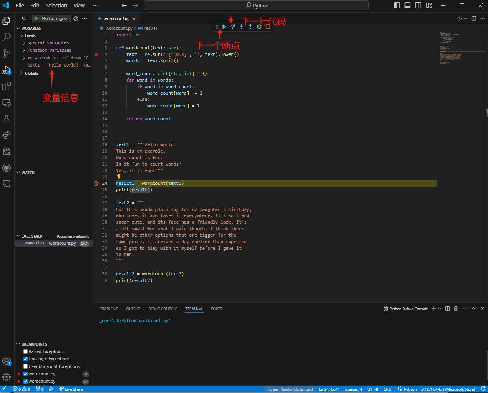

# Python task

### 任务概览
| 任务类型 | 任务内容 | 预计耗时 |
| --- |---| ---|
|闯关任务|Python实现wordcount| 15mins|
|闯关任务|Vscode连接InternStudio debug笔记| 15mins|

闯关作业总共分为两个任务，两个任务均完成视作闯关成功。
请将作业发布到知乎、CSDN等任一社交媒体，将作业链接提交到以下问卷，助教老师批改后将获得 50 算力点奖励！！！
提交地址：https://aicarrier.feishu.cn/share/base/form/shrcnZ4bQ4YmhEtMtnKxZUcf1vd

### 任务一

请实现一个wordcount函数，统计英文字符串中每个单词出现的次数。返回一个字典，key为单词，value为对应单词出现的次数。

Eg:

Input:

```python
"""Hello world!  
This is an example.  
Word count is fun.  
Is it fun to count words?  
Yes, it is fun!"""
```

Output:

```python
{'hello': 1, 'world': 1, 'this': 1, 'is': 4, 'an': 1, 'example': 1, 'word': 1, 'count': 2,
'fun': 3, 'it': 2, 'to': 1, 'words': 1, 'yes': 1}
```

TIPS：记得先去掉标点符号,然后把每个单词转换成小写。不需要考虑特别多的标点符号，只需要考虑实例输入中存在的就可以。

```python
text = """
Got this panda plush toy for my daughter's birthday,
who loves it and takes it everywhere. It's soft and
super cute, and its face has a friendly look. It's
a bit small for what I paid though. I think there
might be other options that are bigger for the
same price. It arrived a day earlier than expected,
so I got to play with it myself before I gave it
to her.
"""

import re
def wordcount(text: str):
    text = re.sub(r'[^\w\s]', '', text).lower()
    words = text.split()

    word_count: dict[str, int] = {}
    for word in words:
        if word in word_count:
            word_count[word] += 1
        else:
            word_count[word] = 1
    
    return word_count

```

### 任务二

请使用本地vscode连接远程开发机，将上面你写的wordcount函数在开发机上进行debug，体验debug的全流程，并完成一份debug笔记(需要截图)。


