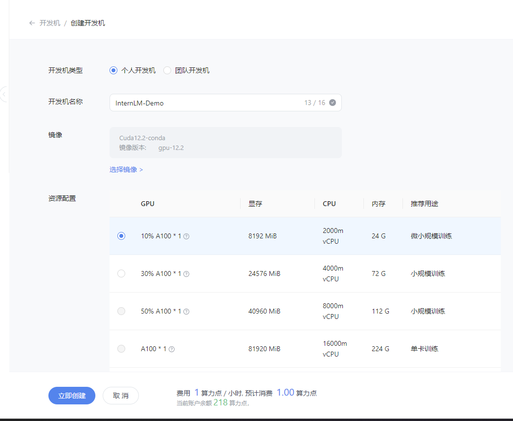
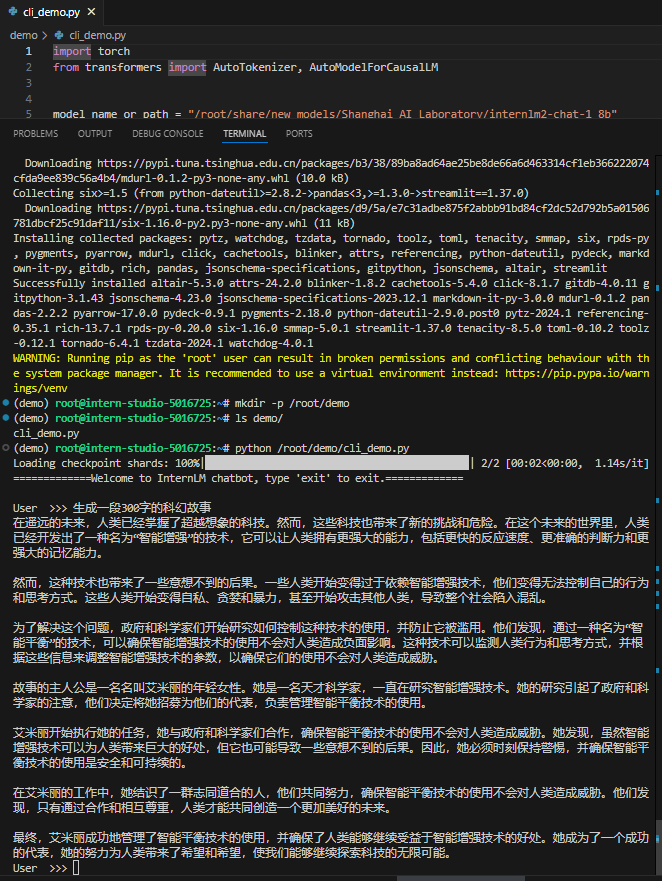

# 8G 显存玩转书生大模型 Demo

- 记录复现过程并截图

## 基础任务（完成此任务即完成闯关）

- 使用 Cli Demo 完成 InternLM2-Chat-1.8B 模型的部署，并生成 300 字小故事，记录复现过程并截图。

### 1. 创建开发机
资源配置选择`10% A100`，镜像选择`Cuda12.1-conda`，将开发机命名为`InternLM-Demo`并创建:


### 2. 配置环境
用conda创建虚拟环境`demo`并通过pip和conda安装所需依赖:
```bash
# 创建环境
conda create -n demo python=3.10 -y
# 激活环境
conda activate demo
# 安装 torch
conda install pytorch==2.1.2 torchvision==0.16.2 torchaudio==2.1.2 pytorch-cuda=12.1 -c pytorch -c nvidia -y
# 安装其他依赖
pip install transformers==4.38
pip install sentencepiece==0.1.99
pip install einops==0.8.0
pip install protobuf==5.27.2
pip install accelerate==0.33.0
pip install streamlit==1.37.0
```
### 3.通过Cli Demo 部署 InternLM2-Chat-1.8B 模型

首先，我们创建一个目录，用于存放我们的代码。并创建一个 `cli_demo.py`。

```bash
mkdir -p /root/demo
touch /root/demo/cli_demo.py
```

然后，我们将下面的代码复制到 `cli_demo.py` 中。

```python
import torch
from transformers import AutoTokenizer, AutoModelForCausalLM


model_name_or_path = "/root/share/new_models/Shanghai_AI_Laboratory/internlm2-chat-1_8b"

tokenizer = AutoTokenizer.from_pretrained(model_name_or_path, trust_remote_code=True, device_map='cuda:0')
model = AutoModelForCausalLM.from_pretrained(model_name_or_path, trust_remote_code=True, torch_dtype=torch.bfloat16, device_map='cuda:0')
model = model.eval()

system_prompt = """You are an AI assistant whose name is InternLM (书生·浦语).
- InternLM (书生·浦语) is a conversational language model that is developed by Shanghai AI Laboratory (上海人工智能实验室). It is designed to be helpful, honest, and harmless.
- InternLM (书生·浦语) can understand and communicate fluently in the language chosen by the user such as English and 中文.
"""

messages = [(system_prompt, '')]

print("=============Welcome to InternLM chatbot, type 'exit' to exit.=============")

while True:
    input_text = input("\nUser  >>> ")
    input_text = input_text.replace(' ', '')
    if input_text == "exit":
        break

    length = 0
    for response, _ in model.stream_chat(tokenizer, input_text, messages):
        if response is not None:
            print(response[length:], flush=True, end="")
            length = len(response)
```

接下来，我们便可以通过 `python /root/demo/cli_demo.py` 来启动我们的 Demo。

效果如下图所示：



## 进阶任务（闯关不要求完成此任务）

- 使用 LMDeploy 完成 InternLM-XComposer2-VL-1.8B 的部署，并完成一次图文理解对话，记录复现过程并截图。
- 使用 LMDeploy 完成 InternVL2-2B 的部署，并完成一次图文理解对话，记录复现过程并截图。

## 闯关材料提交（完成任务并且提交材料视为闯关成功）
- 闯关作业总共分为一个任务，一个任务完成视作闯关成功。
- 请将作业发布到知乎、CSDN等任一社交媒体，将作业链接提交到以下问卷，助教老师批改后将获得 100 算力点奖励！！！ 
- 提交地址：https://aicarrier.feishu.cn/share/base/form/shrcnZ4bQ4YmhEtMtnKxZUcf1vd
