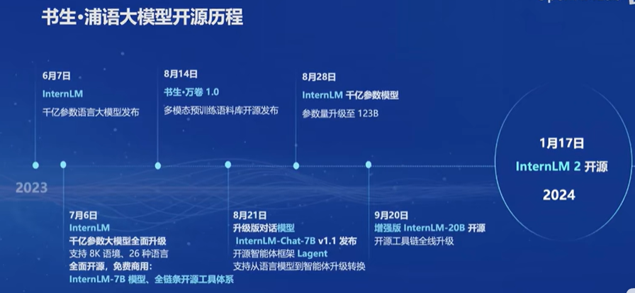

# 任务

观看本关卡视频和官网[https://internlm.intern-ai.org.cn/](https://internlm.intern-ai.org.cn/)后，写一篇关于书生大模型全链路开源开放体系的笔记发布到知乎、CSDN等任一社交媒体，将作业链接提交到以下问卷，助教老师批改后将获得 100 算力点奖励！！！  

提交地址：https://aicarrier.feishu.cn/share/base/form/shrcnZ4bQ4YmhEtMtnKxZUcf1vd

# 1. 大模型背景介绍
大模型的发展历程见证了从传统统计学习到深度学习的转变，特别是Transformer和GPT-3等模型的问世，标志着AI进入了一个新的时代。如今，这些大模型在智能体AI和机器人领域发挥着重要作用，如游戏AI、聊天机器人、蛋白质结构预测、决策规划和人机交互等，极大地提升了AI的性能和交互能力，推动了技术的广泛应用和深入发展，成为了通往通用智能的一把钥匙。

# 2. 书生发展历程
书生大模型自开源以来，经历了多个阶段的发展和完善。其开源历程体现了对开放科学精神的坚持，旨在推动AI技术的普及和创新。书生浦语大模型自发布之初便采用开源模式，允许研究者、开发者和爱好者自由使用和贡献。随着版本的迭代，模型不断吸收社区反馈，优化性能，拓宽应用场景。书生大模型以其多语言支持、模块化设计、高效性能和社区驱动的特色，在AI领域树立了独特价值。覆盖多种语言的模型满足了全球用户的多样化需求，模块化设计让自定义和调整更加灵活，而优化后的算法和结构确保了性能与成本效益的平衡。依托于活跃的开源社区，书生浦语大模型汇聚了广泛的智慧，共同推动其持续发展，成为了研究和应用的重要工具。

# 3. InternLM2亮点

InternLM2作为一款强大的语言模型，其特色在于以下几个方面：
1. **超长上下文**：在20万token的上下文中，几乎完美实现了“大海捞针”的能力，这意味着它能够处理大量的信息，并在其中找到特定的答案或线索。
2. **综合性能全面提升**：在推理、数学和代码等领域都有显著的提升，尤其是在与ChatGPT的对比中，它在重点评测上表现出色。
3. **优秀的对话和创作体验**：精准的指令跟随和丰富的结构化创作功能，使其在AlpacaEval2和Gemini Pro等测试中超越了GPT-3.5和GPT-4。
4. **工具调用能力整体升级**：支持工具多轮调用，并与复杂智能体搭建集成，增强了其在实际应用中的灵活性和效率。
5. **突出的数理能力和实用的数据分析功能**：强大的内生计算能力，加上代码解释功能，使得它在GSIM8K和MATH等数据集上的表现达到或超过了GPT-4的水平。

# 4 全链路体系
书生全链路开源体系是一套强大的技术解决方案，它由六个关键组件组成:

1. **数据**：提供了2TB的数据资源，涵盖了多种模态与任务，支持大规模的语言模型训练。
2. **预训练**：利用并行训练技术，实现了极致的优化速度，达到了3600 tokens/sec/gpu，适合进行高效的预训练阶段。
3. **微调**：支持全参数微调，能够灵活调整模型参数，以适应特定的任务需求。
4. **部署**：提供了完整的部署方案，包括性能领先的全链路部署能力，能够在每秒生成超过2000个tokens，确保了高效率的模型部署。
5. **评测**：通过OpenCompass进行全面评估，包括100套评测集和50万道题目，能够实现性能的可复现性和全面的评测。
6. **应用**：支持多种智能体，如Lagent和AgentLego，以及代码解释器等多种工具，适用于实际的应用场景。
这套体系不仅提供了丰富的数据资源和高效的计算能力，还具备灵活的微调和部署功能，以及全面的评测和应用支持，使得研究者能够快速地构建、训练和部署高质量的NLP模型，并将其应用于实际问题解决中。

