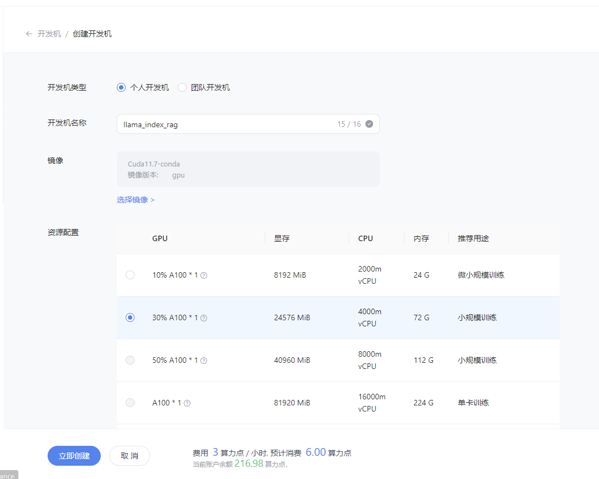
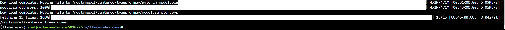
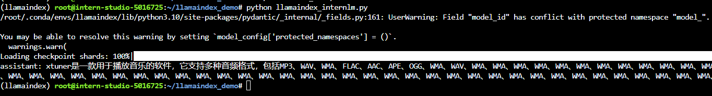
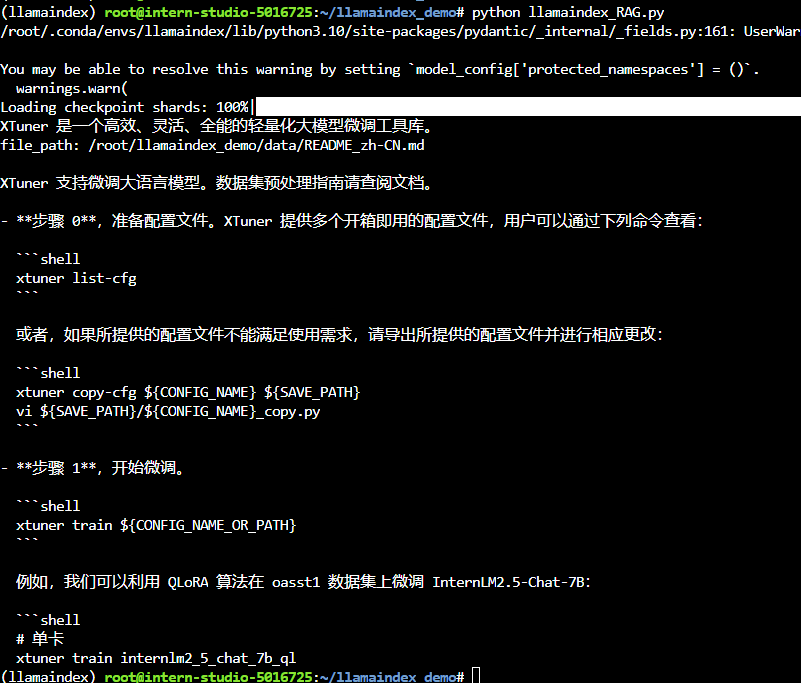

# Llamaindex RAG实践

## 基础任务 (完成此任务即完成闯关)


- **任务要求**：基于 LlamaIndex 构建自己的 RAG 知识库，寻找一个问题 A 在使用 LlamaIndex 之前InternLM2-Chat-1.8B模型不会回答，借助 LlamaIndex 后 InternLM2-Chat-1.8B 模型具备回答 A 的能力，截图保存。

### 1. 创建开发机
填写 `开发机名称` 为`llama_index` 后，点击 选择镜像 使用 `Cuda11.7-conda` 镜像，然后在资源配置中，使用 `30% A100 * 1` 的选项，然后立即创建开发机器:


### 2. 准备环境与模型
#### 2.1 配置虚拟环境
进入开发机后，创建新的conda环境，命名为 `llamaindex`，在命令行模式下运行：
```bash
conda create -n llamaindex python=3.10
```
复制完成后，在本地查看环境。
```bash
conda env list
```
结果如下所示。
```bash
# conda environments:
#
base                  *  /root/.conda
llamaindex               /root/.conda/envs/llamaindex
```

运行 `conda` 命令，激活 `llamaindex` 然后安装相关基础依赖
**python** 虚拟环境:
```bash
conda activate llamaindex
conda install pytorch==2.0.1 torchvision==0.15.2 torchaudio==2.0.2 pytorch-cuda=11.7 -c pytorch -c nvidia
```
**安装python 依赖包**
```bash
pip install einops
pip install  protobuf
```


#### 2.2 安装 Llamaindex
安装 Llamaindex和相关的包
```bash
conda activate llamaindex
pip install llama-index==0.10.38 llama-index-llms-huggingface==0.2.0 "transformers[torch]==4.41.1" "huggingface_hub[inference]==0.23.1" huggingface_hub==0.23.1 sentence-transformers==2.7.0 sentencepiece==0.2.0
```

#### 2.3 下载 Sentence Transformer 模型

源词向量模型 [Sentence Transformer](https://huggingface.co/sentence-transformers/paraphrase-multilingual-MiniLM-L12-v2):（我们也可以选用别的开源词向量模型来进行 Embedding，目前选用这个模型是相对轻量、支持中文且效果较好的，同学们可以自由尝试别的开源词向量模型）
运行以下指令，新建一个python文件
```bash
cd ~
mkdir llamaindex_demo
mkdir model
cd ~/llamaindex_demo
touch download_hf.py
```
打开`download_hf.py` 贴入以下代码
```bash
import os

# 设置环境变量
os.environ['HF_ENDPOINT'] = 'https://hf-mirror.com'

# 下载模型
os.system('huggingface-cli download --resume-download sentence-transformers/paraphrase-multilingual-MiniLM-L12-v2 --local-dir /root/model/sentence-transformer')
```

然后，在 /root/llamaindex_demo 目录下执行该脚本即可自动开始下载：
```bash
cd /root/llamaindex_demo
conda activate llamaindex
python download_hf.py
```
更多关于镜像使用可以移步至 [HF Mirror](https://hf-mirror.com/) 查看。



#### 2.4 下载 NLTK 相关资源
我们在使用开源词向量模型构建开源词向量的时候，需要用到第三方库 `nltk` 的一些资源。正常情况下，其会自动从互联网上下载，但可能由于网络原因会导致下载中断，此处我们可以从国内仓库镜像地址下载相关资源，保存到服务器上。
我们用以下命令下载 nltk 资源并解压到服务器上：
```bash
cd /root
git clone https://gitee.com/yzy0612/nltk_data.git  --branch gh-pages
cd nltk_data
mv packages/*  ./
cd tokenizers
unzip punkt.zip
cd ../taggers
unzip averaged_perceptron_tagger.zip
```
之后使用时服务器即会自动使用已有资源，无需再次下载
### 3. LlamaIndex HuggingFaceLLM
运行以下指令，把 `InternLM2 1.8B` 软连接出来
```bash
cd ~/model
ln -s /root/share/new_models/Shanghai_AI_Laboratory/internlm2-chat-1_8b/ ./
```
运行以下指令，新建一个python文件
```bash
cd ~/llamaindex_demo
touch llamaindex_internlm.py
```
打开llamaindex_internlm.py 贴入以下代码
```python
from llama_index.llms.huggingface import HuggingFaceLLM
from llama_index.core.llms import ChatMessage
llm = HuggingFaceLLM(
    model_name="/root/model/internlm2-chat-1_8b",
    tokenizer_name="/root/model/internlm2-chat-1_8b",
    model_kwargs={"trust_remote_code":True},
    tokenizer_kwargs={"trust_remote_code":True}
)

rsp = llm.chat(messages=[ChatMessage(content="xtuner是什么？")])
print(rsp)
```
之后运行
```bash
conda activate llamaindex
cd ~/llamaindex_demo/
python llamaindex_internlm.py
```
结果为：

回答的效果并不好，并不是我们想要的xtuner。

### 4. LlamaIndex RAG
安装 `LlamaIndex` 词嵌入向量依赖
```bash
conda activate llamaindex
pip install llama-index-embeddings-huggingface llama-index-embeddings-instructor
```
运行以下命令，获取知识库
```bash
cd ~/llamaindex_demo
mkdir data
cd data
git clone https://github.com/InternLM/xtuner.git
mv xtuner/README_zh-CN.md ./
```
运行以下指令，新建一个python文件
```bash
cd ~/llamaindex_demo
touch llamaindex_RAG.py
```
打开`llamaindex_RAG.py`贴入以下代码
```python

from llama_index.core import VectorStoreIndex, SimpleDirectoryReader, Settings

from llama_index.embeddings.huggingface import HuggingFaceEmbedding
from llama_index.llms.huggingface import HuggingFaceLLM

#初始化一个HuggingFaceEmbedding对象，用于将文本转换为向量表示
embed_model = HuggingFaceEmbedding(
#指定了一个预训练的sentence-transformer模型的路径
    model_name="/root/model/sentence-transformer"
)
#将创建的嵌入模型赋值给全局设置的embed_model属性，
#这样在后续的索引构建过程中就会使用这个模型。
Settings.embed_model = embed_model

llm = HuggingFaceLLM(
    model_name="/root/model/internlm2-chat-1_8b",
    tokenizer_name="/root/model/internlm2-chat-1_8b",
    model_kwargs={"trust_remote_code":True},
    tokenizer_kwargs={"trust_remote_code":True}
)
#设置全局的llm属性，这样在索引查询时会使用这个模型。
Settings.llm = llm

#从指定目录读取所有文档，并加载数据到内存中
documents = SimpleDirectoryReader("/root/llamaindex_demo/data").load_data()
#创建一个VectorStoreIndex，并使用之前加载的文档来构建索引。
# 此索引将文档转换为向量，并存储这些向量以便于快速检索。
index = VectorStoreIndex.from_documents(documents)
# 创建一个查询引擎，这个引擎可以接收查询并返回相关文档的响应。
query_engine = index.as_query_engine()
response = query_engine.query("xtuner是什么?")

print(response)
```
之后运行
```bash
conda activate llamaindex
cd ~/llamaindex_demo/
python llamaindex_RAG.py
```
结果为：


借助RAG技术后，就能获得我们想要的答案了。

## 5. LlamaIndex web
运行之前首先安装依赖

```shell
pip install streamlit==1.36.0
```

运行以下指令，新建一个python文件

```bash
cd ~/llamaindex_demo
touch app.py
```

打开`app.py`贴入以下代码
```python
import streamlit as st
from llama_index.core import VectorStoreIndex, SimpleDirectoryReader, Settings
from llama_index.embeddings.huggingface import HuggingFaceEmbedding
from llama_index.llms.huggingface import HuggingFaceLLM

st.set_page_config(page_title="llama_index_demo", page_icon="🦜🔗")
st.title("llama_index_demo")

# 初始化模型
@st.cache_resource
def init_models():
    embed_model = HuggingFaceEmbedding(
        model_name="/root/model/sentence-transformer"
    )
    Settings.embed_model = embed_model

    llm = HuggingFaceLLM(
        model_name="/root/model/internlm2-chat-1_8b",
        tokenizer_name="/root/model/internlm2-chat-1_8b",
        model_kwargs={"trust_remote_code": True},
        tokenizer_kwargs={"trust_remote_code": True}
    )
    Settings.llm = llm

    documents = SimpleDirectoryReader("/root/llamaindex_demo/data").load_data()
    index = VectorStoreIndex.from_documents(documents)
    query_engine = index.as_query_engine()

    return query_engine

# 检查是否需要初始化模型
if 'query_engine' not in st.session_state:
    st.session_state['query_engine'] = init_models()

def greet2(question):
    response = st.session_state['query_engine'].query(question)
    return response

      
# Store LLM generated responses
if "messages" not in st.session_state.keys():
    st.session_state.messages = [{"role": "assistant", "content": "你好，我是你的助手，有什么我可以帮助你的吗？"}]    

    # Display or clear chat messages
for message in st.session_state.messages:
    with st.chat_message(message["role"]):
        st.write(message["content"])

def clear_chat_history():
    st.session_state.messages = [{"role": "assistant", "content": "你好，我是你的助手，有什么我可以帮助你的吗？"}]

st.sidebar.button('Clear Chat History', on_click=clear_chat_history)

# Function for generating LLaMA2 response
def generate_llama_index_response(prompt_input):
    return greet2(prompt_input)

# User-provided prompt
if prompt := st.chat_input():
    st.session_state.messages.append({"role": "user", "content": prompt})
    with st.chat_message("user"):
        st.write(prompt)

# Gegenerate_llama_index_response last message is not from assistant
if st.session_state.messages[-1]["role"] != "assistant":
    with st.chat_message("assistant"):
        with st.spinner("Thinking..."):
            response = generate_llama_index_response(prompt)
            placeholder = st.empty()
            placeholder.markdown(response)
    message = {"role": "assistant", "content": response}
    st.session_state.messages.append(message)
```

之后运行
```bash
streamlit run app.py
```

参考[L0/Linux的2.3部分](https://github.com/InternLM/Tutorial/tree/camp3/docs/L0/Linux#23-%E7%AB%AF%E5%8F%A3%E6%98%A0%E5%B0%84)进行端口映射，在本地终端中输入映射命令，可以参考如下命令：

```bash
ssh -p {ssh端口，从InternStudio获取} root@ssh.intern-ai.org.cn -CNg -L 7860:127.0.0.1:8501 -o StrictHostKeyChecking=no
```

然后在命令行点击，红框里的url。


即可进入以下网页，然后就可以开始尝试问问题了。


询问结果为：


## 闯关材料提交 (完成任务并且提交材料时为闯关成功)

- 请将作业发布到知乎、CSDN等任一社交媒体，将作业链接提交到以下问卷，助教老师批改后将获得 100 算力点奖励！！！
- 提交地址：https://aicarrier.feishu.cn/share/base/form/shrcnZ4bQ4YmhEtMtnKxZUcf1vd
