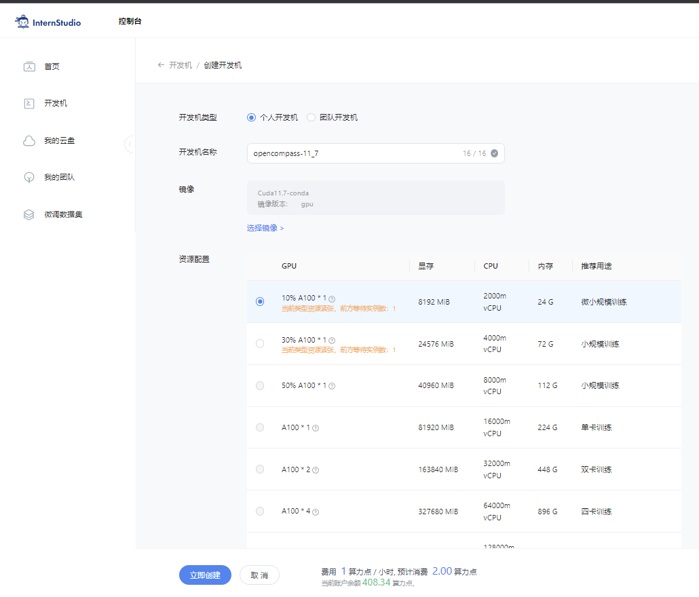
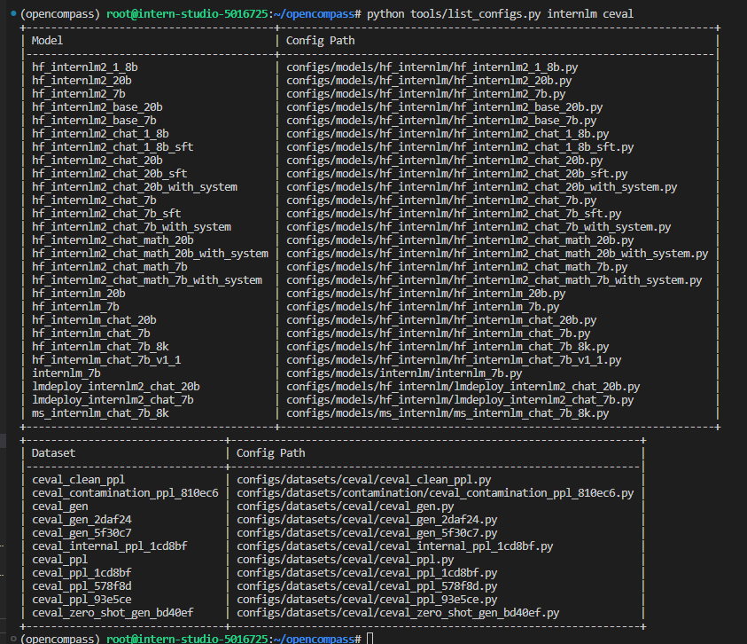
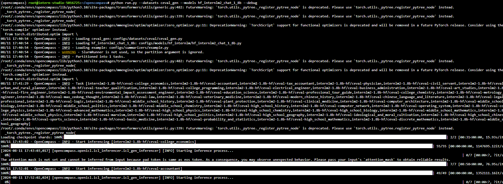
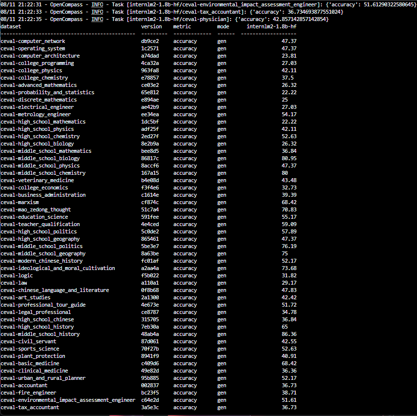

# OpenCompass 评测 InternLM-1.8B 实践

- 记录复现过程并截图。

## 基础任务（完成此任务即完成闯关）

- 使用 OpenCompass 评测 internlm2-chat-1.8b 模型在 ceval 数据集上的性能，记录复现过程并截图。

### 1. 环境配置
#### 1.1 创建开发机
选用10% A100, Cuda 11.7创建开发机，命名为opencompass:



#### 1.2 安装——面向GPU的环境安装
```bash
conda create -n opencompass python=3.10
conda activate opencompass
conda install pytorch==2.1.2 torchvision==0.16.2 torchaudio==2.1.2 pytorch-cuda=12.1 -c pytorch -c nvidia -y
cd ~
git clone -b 0.2.4 https://github.com/open-compass/opencompass
cd opencompass
pip install -e .
apt-get update
apt-get install cmake
pip install -r requirements.txt
pip install protobuf
```

### 2. 数据准备

#### 2.1 评测数据集
解压评测数据集到 data/ 处
```shell
cp /share/temp/datasets/OpenCompassData-core-20231110.zip /root/opencompass/
unzip OpenCompassData-core-20231110.zip
```
将会在 OpenCompass 下看到data文件夹

#### 2.2 InternLM和ceval 相关的配置文件

列出所有跟 InternLM 及 C-Eval 相关的配置
```python
    python tools/list_configs.py internlm ceval
```
将会看到




### 3. 启动评测 (10% A100 8GB 资源)

#### 3.1 使用命令行配置参数法进行评测

打开 opencompass文件夹下configs/models/hf_internlm/的`hf_internlm2_chat_1_8b.py` ,贴入以下代码

```python
    from opencompass.models import HuggingFaceCausalLM
    
    
    models = [
        dict(
            type=HuggingFaceCausalLM,
            abbr='internlm2-1.8b-hf',
            path="/share/new_models/Shanghai_AI_Laboratory/internlm2-chat-1_8b",
            tokenizer_path='/share/new_models/Shanghai_AI_Laboratory/internlm2-chat-1_8b',
            model_kwargs=dict(
                trust_remote_code=True,
                device_map='auto',
            ),
            tokenizer_kwargs=dict(
                padding_side='left',
                truncation_side='left',
                use_fast=False,
                trust_remote_code=True,
            ),
            max_out_len=100,
            min_out_len=1,
            max_seq_len=2048,
            batch_size=8,
            run_cfg=dict(num_gpus=1, num_procs=1),
        )
    ]
```


确保按照上述步骤正确安装 OpenCompass 并准备好数据集后，可以通过以下命令评测 InternLM2-Chat-1.8B 模型在 C-Eval 数据集上的性能。由于 OpenCompass 默认并行启动评估过程，我们可以在第一次运行时以 --debug 模式启动评估，并检查是否存在问题。在 --debug 模式下，任务将按顺序执行，并实时打印输出。

```bash
    #环境变量配置
    export MKL_SERVICE_FORCE_INTEL=1
    #或
    export MKL_THREADING_LAYER=GNU
```
<!---->
```bash
    python run.py --datasets ceval_gen --models hf_internlm2_chat_1_8b --debug
```

命令解析
```bash
    python run.py
    --datasets ceval_gen \ # 数据集准备
    --models hf_internlm2_chat_1_8b \  # 模型准备
    --debug
```
如果一切正常，您应该看到屏幕上显示：

    [2024-08-09 16:48:07,016] [opencompass.openicl.icl_inferencer.icl_gen_inferencer] [INFO] Starting inference process...



评测完成后，将会看到：

    dataset                                         version    metric         mode    internlm2-1.8b-hf
    ----------------------------------------------  ---------  -------------  ------  -----------------------
    ceval-computer_network                          db9ce2     accuracy       gen      47.37                                                                           
    ceval-operating_system                          1c2571     accuracy       gen      47.37                                                                                 
    ceval-computer_architecture                     a74dad     accuracy       gen      23.81                                                                                 
    ceval-college_programming                       4ca32a     accuracy       gen      13.51                                                                                 
    ceval-college_physics                           963fa8     accuracy       gen      42.11                                                                                 
    ceval-college_chemistry                         e78857     accuracy       gen      33.33                                                                                 
    ceval-advanced_mathematics                      ce03e2     accuracy       gen      10.53                                                                                 
    ...          

#### 3.2 使用配置文件修改参数法进行评测
除了通过命令行配置实验外，OpenCompass 还允许用户在配置文件中编写实验的完整配置，并通过 run.py 直接运行它。配置文件是以 Python 格式组织的，并且必须包括 datasets 和 models 字段。本次测试配置在 `configs`文件夹 中。此配置通过 继承机制 引入所需的数据集和模型配置，并以所需格式组合 datasets 和 models 字段。
运行以下代码，在configs文件夹下创建`eval_tutorial_demo.py`
```bash
cd /root/opencompass/configs
touch eval_tutorial_demo.py
```
打开`eval_tutorial_demo.py` 贴入以下代码
```python
from mmengine.config import read_base

with read_base():
    from .datasets.ceval.ceval_gen import ceval_datasets
    from .models.hf_internlm.hf_internlm2_chat_1_8b import models as hf_internlm2_chat_1_8b_models

datasets = ceval_datasets
models = hf_internlm2_chat_1_8b_models
```

因此，运行任务时，我们只需将配置文件的路径传递给 run.py：

```bash
cd /root/opencompass
python run.py configs/eval_tutorial_demo.py --debug
```

如果一切正常，您应该看到屏幕上显示：

    [2024-08-09 16:48:07,016] [opencompass.openicl.icl_inferencer.icl_gen_inferencer] [INFO] Starting inference process...

评测完成后，将会看到：

    dataset                                         version    metric         mode    internlm2-1.8b-hf
    ----------------------------------------------  ---------  -------------  ------  -----------------------
    ceval-computer_network                          db9ce2     accuracy       gen      47.37                                                                           
    ceval-operating_system                          1c2571     accuracy       gen      47.37                                                                                 
    ceval-computer_architecture                     a74dad     accuracy       gen      23.81                                                                                 
    ceval-college_programming                       4ca32a     accuracy       gen      13.51                                                                                 
    ceval-college_physics                           963fa8     accuracy       gen      42.11                                                                                 
    ceval-college_chemistry                         e78857     accuracy       gen      33.33                                                                                 
    ceval-advanced_mathematics                      ce03e2     accuracy       gen      10.53                                                                                 
    ...      





## 进阶任务（闯关不要求完成此任务）

- 使用 OpenCompass 进行主观评测（选做）
- 使用 OpenCompass 评测 InternLM2-Chat-1.8B 模型使用 LMDeploy部署后在 ceval 数据集上的性能（选做）
- 使用 OpenCompass 进行调用API评测（优秀学员必做）


## 闯关材料提交（完成任务并且提交材料视为闯关成功）
- 闯关作业总共分为一个任务，一个任务完成视作闯关成功。
- 请将作业发布到知乎、CSDN等任一社交媒体，将作业链接提交到以下问卷，助教老师批改后将获得 50 算力点奖励！！！ 
- 提交地址：https://aicarrier.feishu.cn/share/base/form/shrcnZ4bQ4YmhEtMtnKxZUcf1vd
