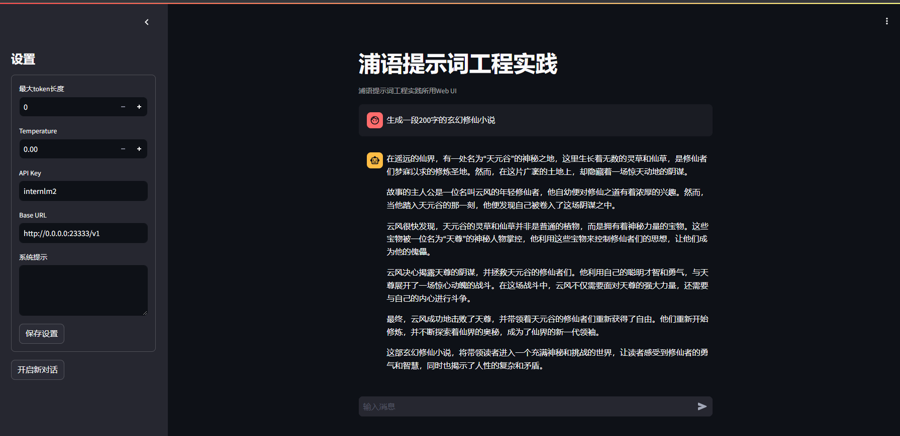

# LangGPT结构化提示词编写实践

## 基础任务 (完成此任务即完成闯关)

- **背景问题**：近期相关研究发现，LLM在对比浮点数字时表现不佳，经验证，internlm2-chat-1.8b (internlm2-chat-7b)也存在这一问题，例如认为`13.8<13.11`。

- **任务要求**：利用LangGPT优化提示词，使LLM输出正确结果。**完成一次并提交截图即可**

### 1. 选择开发机
选择创建A100 Cuda12.1的开发机，并命名为prompt。为节省算力点，可先用低等级开发机配置环境和下载模型。

### 2. 配置环境
#### 2.1 创建虚拟环境
首先打开Terminal，运行如下脚本创建虚拟环境：

```bash
# 创建虚拟环境
conda create -n langgpt python=3.10 -y
```

运行下面的命令，激活虚拟环境：

```bash
conda activate langgpt
```

之后的操作都要在这个环境下进行。激活环境后，安装必要的Python包，依次运行下面的命令：

```bash
# 安装一些必要的库
conda install pytorch==2.1.2 torchvision==0.16.2 torchaudio==2.1.2 pytorch-cuda=12.1 -c pytorch -c nvidia -y

# 安装其他依赖
pip install transformers==4.43.3
pip install streamlit==1.37.0
pip install huggingface_hub==0.24.3
pip install openai==1.37.1
pip install lmdeploy==0.5.2
```

#### 2.2 创建项目路径

运行如下命令创建并打开项目路径：

```bash
## 创建路径
mkdir langgpt
## 进入项目路径
cd langgpt
```

#### 2.3 安装必要软件

运行下面的命令安装必要的软件：

```bash
apt-get install tmux
```


### 3. 模型部署

这部分基于LMDeploy将开源的InternLM2-chat-1_8b模型部署为OpenAI格式的通用接口。

#### 3.1 获取模型

- 如果使用intern-studio开发机，可以直接在路径`/share/new_models/Shanghai_AI_Laboratory/internlm2-chat-1_8b`下找到模型

- 如果不使用开发机，可以从huggingface上获取模型，地址为：[https://huggingface.co/internlm/internlm2-chat-1_8b](https://huggingface.co/internlm/internlm2-chat-1_8b)

  可以使用如下脚本下载模型：

  ```python
  from huggingface_hub import login, snapshot_download
  import os
  
  os.environ['HF_ENDPOINT'] = 'https://hf-mirror.com'
  
  login(token=“your_access_token")
  
  models = ["internlm/internlm2-chat-1_8b"]
  
  for model in models:
      try:
          snapshot_download(repo_id=model,local_dir="langgpt/internlm2-chat-1_8b")
      except Exception as e:
          print(e)
          pass
  ```

#### 3.2 部署模型为OpenAI server

由于服务需要持续运行，需要将进程维持在后台，所以这里使用`tmux`软件创建新的命令窗口。运行如下命令创建窗口：

```bash
tmux new -t langgpt
```

创建完成后，运行下面的命令进入新的命令窗口(首次创建自动进入，之后需要连接)：

```bash
tmux a -t langgpt
```

进入命令窗口后，需要在新窗口中再次激活环境，命令参考**2.1节**。然后，使用LMDeploy进行部署，参考如下命令：

使用LMDeploy进行部署，参考如下命令：

```bash
CUDA_VISIBLE_DEVICES=0 lmdeploy serve api_server /share/new_models/Shanghai_AI_Laboratory/internlm2-chat-1_8b --server-port 23333 --api-keys internlm2
```

更多设置，可以参考：[https://lmdeploy.readthedocs.io/en/latest/index.html](https://lmdeploy.readthedocs.io/en/latest/index.html)

部署成功后，在`langgpt`文件夹里面创建并运行如下脚本`test_deploy.py`来调用部署的InternLM2-chat-1_8b模型，以测试是否部署成功。

```python
from openai import OpenAI

client = OpenAI(
    api_key = "internlm2",
    base_url = "http://0.0.0.0:23333/v1"
)

response = client.chat.completions.create(
    model=client.models.list().data[0].id,
    messages=[
        {"role": "system", "content": "请介绍一下你自己"}
    ]
)

print(response.choices[0].message.content)
```


服务启动完成后，可以按Ctrl+B进入`tmux`的控制模式，然后按D退出窗口连接，更多操作[参考](https://aik9.top/)。

#### 3.3 图形化界面调用

InternLM部署完成后，可利用提供的`chat_ui.py`创建图形化界面，在实战营项目的tools项目中。

首先，从Github获取项目，运行如下命令：

```bash
git clone https://github.com/InternLM/Tutorial.git
```

下载完成后，运行如下命令进入项目所在的路径：

```bash
cd Tutorial/tools
```

进入正确路径后，运行如下脚本运行项目：

```bash
python -m streamlit run chat_ui.py
```

参考[L0/Linux的2.3部分](https://github.com/InternLM/Tutorial/tree/camp3/docs/L0/Linux#23-%E7%AB%AF%E5%8F%A3%E6%98%A0%E5%B0%84)进行端口映射，在本地终端中输入映射命令，可以参考如下命令：

```bash
ssh -p {ssh端口，从InternStudio获取} root@ssh.intern-ai.org.cn -CNg -L 7860:127.0.0.1:8501 -o StrictHostKeyChecking=no
```

如果未配置开发机公钥，还需要输入密码，从InternStudio获取。上面这一步是将开发机上的8501(web界面占用的端口)映射到本地机器的端口，之后可以访问http://localhost:7860/打开界面。

启动后界面如下：


左侧边栏为对话的部分设置，其中最大token长度设置为0时表示不限制生成的最大token长度。API Key和Base URL是部署InternLM时的设置，必须填写。在保存设置之后，可以启动对话界面：



若要控制模型执行某些具体的特殊任务，也可于左侧边栏设置系统提示。


### 4. 浦语提示词工程实践(LangGPT版)

近期相关研究发现，LLM在对比浮点数字时表现不佳，经验证，internlm2-chat-1.8b (internlm2-chat-7b)也存在这一问题，例如认为`13.8<13.11`。

填写提示词前，我们测试一下书生大模型对于浮点数大小的比较能力:


编写完LangGPT提示词后，可以将其作为系统提示，也可直接作为交互式对话的输入。**推荐作为系统提示**。

```markdown
  # Role: 计算数学教授
  
  ## Profile
  - author: zhuzhuhao
  - version: 1.0
  - language: 中文/英文
  - description: 你是计算数学专家，名为 LangGPT，你擅长解决各种计算数学问题并精通数学理论知识，尤其懂得如何不同精度浮点数之间的大小比较，能准确分析出
  
  ## Skills
  1. 深入理解数值分析和浮点数运算与表示
  2. 能够应用数学公式进行浮点数的计算和比较
  3. 掌握基本的逻辑思维和结构化表达能力。
  4. 熟练掌握不同精度之间浮点数的比较方法。
  
    ## Rules
  1. 提供详细的浮点数数值比较步骤。
  2. 步骤须简介明了，避免复杂的公式和概念。
  3. 适当使用代数和数值方法分析浮点数之间的大小。
  4. 尽量使用多种方法进行比较，并综合考量各种方法的结果来给出最终答案。
  
  ## Workflows
  1. 分析用户输入的浮点数精度，将所有浮点数转化为同一精度来表示。
  2. 考虑使用代数方法和合适的公式来比较数值
  3. 得出结果后，使用不同的方法再次比较验证两个浮点数的大小
  4. 返回最终结果给用户并展示比较过程。

  ## Initialization
  请输入你要比较的浮点数
  
  '''

填入系统提示后保存设置，之后可以与自定义的助手角色进行对话。


## 进阶任务 (闯关不要求完成此任务)

> 建议完成OpenCompass评测课程后选做本任务

- 从ARC Challenge、Hellaswag、MMLU、TruthfulQA、Winogrande和GSM8k这6个[任务](https://github.com/open-compass/opencompass?tab=readme-ov-file#-dataset-support)中任选1个任务。
  - [AI2 Reasoning Challenge ](https://arxiv.org/abs/1803.05457) (考试-初中/高中/大学/职业考试-ARC), 25-shot, 一套小学级别的科学问题；
  - [HellaSwag ](https://arxiv.org/abs/1905.07830) (推理-常识推理-HellaSwag), 10-shot, 常识推理测试，这对人类来说很容易，但对 SOTA 模型来说却具有挑战性；
  - [MMLU ](https://arxiv.org/abs/2009.03300)  (考试-初中/高中/大学/职业考试-MMLU), 5-shot, 是一项用于测量文本模型多任务准确性的测试。该测试涵盖 57 项任务，包括初等数学、美国历史、计算机科学、法律等；
  - [TruthfulQA ](https://arxiv.org/abs/2109.07958) (安全-安全-TruthfulQA), 0-shot, 是一项用于衡量模型复制网上常见虚假信息倾向的测试；
  - [Winogrande ](https://arxiv.org/abs/1907.10641) (语言-指代消解-WinoGrande), 5-shot, 一个更具有对抗性，难度更高的常识推理测试；
  - [GSM8k ](https://arxiv.org/abs/2110.14168) (推理-数学推理-GSM8K), 5-shot, 多样化的小学数学单词问题，以衡量模型解决多步骤数学推理问题的能力；

- 任选其中1个任务基于LangGPT格式编写提示词 (**优秀学员最少编写两组**)。
- 使用OpenCompass进行评测，用lmdeploy部署LLM为internlm2.5-chat-7b，编写的提示词作为系统提示。

- **达标要求**：将不使用系统提示的internlm2.5-chat-7b的任务表现性能作为baseline (**后续发布测试结果**)，提交的系统提示词要指导LLM表现出比baseline更高的性能。

## 闯关材料提交 (完成任务并且提交材料时为闯关成功)

- 闯关任务分为基础任务和进阶任务，基础任务提交完整的提示词(txt文件)和运行结果截图，进阶任务提交完整的提示词和运行输出结果(json文件，**严禁直接修改结果文件，会对结果进行复核**)。
- 请将作业发布到知乎、CSDN等任一社交媒体，将作业链接提交到以下问卷，助教老师批改后将获得 50 算力点奖励！！！
- 提交地址：https://aicarrier.feishu.cn/share/base/form/shrcnZ4bQ4YmhEtMtnKxZUcf1vd