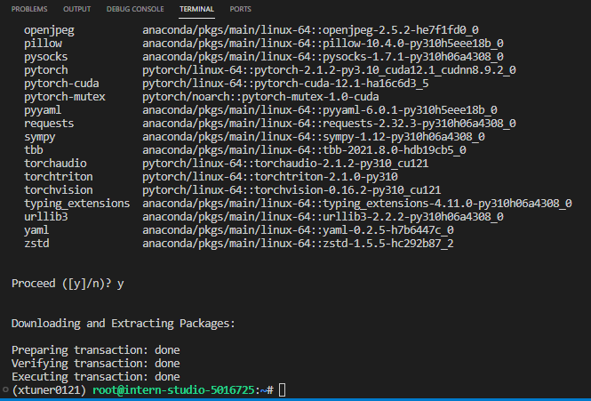
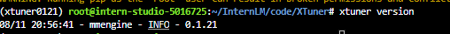
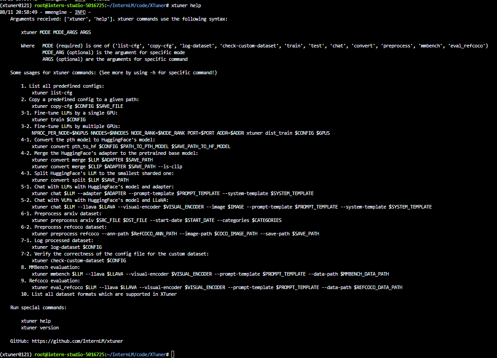
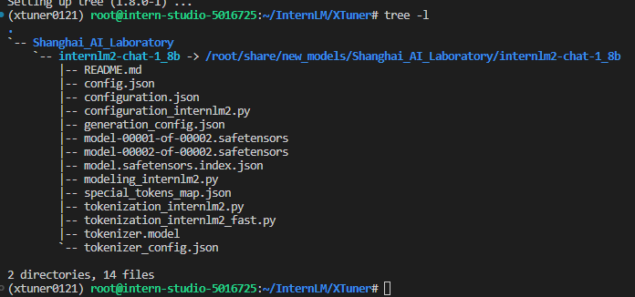
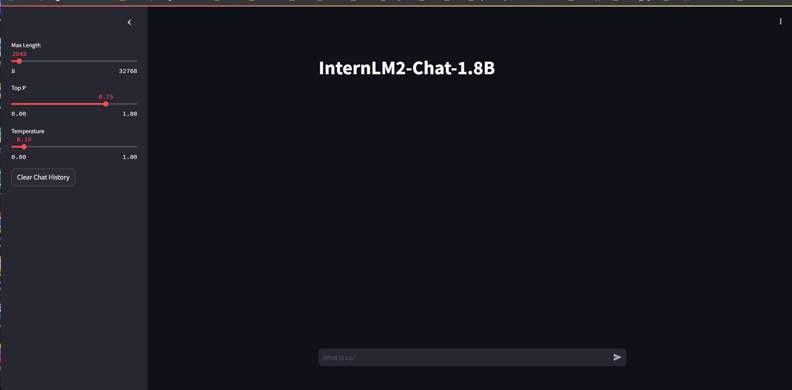

# XTuner 微调个人小助手认知任务

记录复现过程并截图。

## 基础任务（完成此任务即完成闯关并获得 100 算力点）

- 使用 XTuner 微调 InternLM2-Chat-1.8B 实现自己的小助手认知，如下图所示（图中的`伍鲜同志`需替换成自己的昵称），记录复现过程并截图。


### 1. 前期准备
#### 1.1 创建开发机
选用 10%以上 A100, Cuda 12.1开发机，命名为xtuner:


#### 1.2 下载资料
当我们准备好开发机之后，就可以进行下一步的微调任务了。

另外，进入开发机之后，请确保自己已经克隆了Tutorial仓库的资料到本地。

```bash
mkdir -p /root/InternLM/Tutorial
git clone -b camp3  https://github.com/InternLM/Tutorial /root/InternLM/Tutorial
```

#### 1.3 创建虚拟环境
在安装 XTuner 之前，我们需要先创建一个虚拟环境。使用 `Anaconda` 创建一个名为 `xtuner0121` 的虚拟环境，可以直接执行命令。


```bash
# 创建虚拟环境
conda create -n xtuner0121 python=3.10 -y

# 激活虚拟环境（注意：后续的所有操作都需要在这个虚拟环境中进行）
conda activate xtuner0121

# 安装一些必要的库
conda install pytorch==2.1.2 torchvision==0.16.2 torchaudio==2.1.2 pytorch-cuda=12.1 -c pytorch -c nvidia -y
# 安装其他依赖
pip install transformers==4.39.3
pip install streamlit==1.36.0
```



#### 1.3 安装 XTuner

虚拟环境创建完成后，就可以安装 XTuner 了。首先，从 Github 上下载源码。


```bash
# 创建一个目录，用来存放源代码
mkdir -p /root/InternLM/code

cd /root/InternLM/code

git clone -b v0.1.21  https://github.com/InternLM/XTuner /root/InternLM/code/XTuner
```

其次，进入源码目录，执行安装。


```bash
# 进入到源码目录
cd /root/InternLM/code/XTuner
conda activate xtuner0121

# 执行安装
pip install -e '.[deepspeed]'
```

> 如果速度太慢可以换成 `pip install -e '.[deepspeed]' -i https://mirrors.aliyun.com/pypi/simple/`

最后，我们可以验证一下安装结果。


```bash
xtuner version
```



对于很多初学者而言，我们可能不太熟悉 XTuner 的用法，那么我们可以通过以下命令来查看相关的帮助。


```bash
xtuner help
```


对于很多的初学者而言，安装好环境意味着成功了一大半！因此我们接下来就可以进入我们的下一步，准备好我们需要的模型、数据集和配置文件，并进行微调训练！

#### 1.4 模型准备

软件安装好后，我们就可以准备要微调的模型了。

> 对于学习而言，我们可以使用 InternLM 推出的1.8B的小模型来完成此次微调演示。

对于在 InternStudio 上运行的小伙伴们，可以不用通过 HuggingFace、OpenXLab 或者 Modelscope 进行模型的下载，在开发机中已经为我们提供了模型的本地文件，直接使用就可以了。

> 我们可以通过以下代码一键通过符号链接的方式链接到模型文件，这样既节省了空间，也便于管理。


```bash
# 创建一个目录，用来存放微调的所有资料，后续的所有操作都在该路径中进行
mkdir -p /root/InternLM/XTuner

cd /root/InternLM/XTuner

mkdir -p Shanghai_AI_Laboratory

ln -s /root/share/new_models/Shanghai_AI_Laboratory/internlm2-chat-1_8b Shanghai_AI_Laboratory/internlm2-chat-1_8b
```

执行上述操作后，`Shanghai_AI_Laboratory/internlm2-chat-1_8b` 将直接成为一个符号链接，这个链接指向 `/root/share/new_models/Shanghai_AI_Laboratory/internlm2-chat-1_8b` 的位置。

这意味着，当我们访问 `Shanghai_AI_Laboratory/internlm2-chat-1_8b` 时，实际上就是在访问 `/root/share/new_models/Shanghai_AI_Laboratory/internlm2-chat-1_8b` 目录下的内容。通过这种方式，我们无需复制任何数据，就可以直接利用现有的模型文件进行后续的微调操作，从而节省存储空间并简化文件管理。

模型文件准备好后，我们可以使用`tree`命令来观察目录结构。


```bash
apt-get install -y tree

tree -l
```

我们的目录结构应该是这个样子的。

<details>
<summary>目录结构</summary>

```
├── Shanghai_AI_Laboratory
│   └── internlm2-chat-1_8b -> /root/share/new_models/Shanghai_AI_Laboratory/internlm2-chat-1_8b
│       ├── README.md
│       ├── config.json
│       ├── configuration.json
│       ├── configuration_internlm2.py
│       ├── generation_config.json
│       ├── model-00001-of-00002.safetensors
│       ├── model-00002-of-00002.safetensors
│       ├── model.safetensors.index.json
│       ├── modeling_internlm2.py
│       ├── special_tokens_map.json
│       ├── tokenization_internlm2.py
│       ├── tokenization_internlm2_fast.py
│       ├── tokenizer.model
│       └── tokenizer_config.json
```
</details>




> 在目录结构中可以看出，`internlm2-chat-1_8b` 是一个符号链接。


### 2 快速开始

这里我们用 `internlm2-chat-1_8b` 模型，通过 `QLoRA` 的方式来微调一个自己的小助手认知作为案例来进行演示。

#### 2.1 微调前的模型对话

我们可以通过网页端的 Demo 来看看微调前 `internlm2-chat-1_8b` 的对话效果。

首先，我们需要准备一个Streamlit程序的脚本。

Streamlit程序的完整代码是：[tools/xtuner_streamlit_demo.py](../../../tools/xtuner_streamlit_demo.py)。

然后，我们可以直接启动应用。


```bash
conda activate xtuner0121

streamlit run /root/InternLM/Tutorial/tools/xtuner_streamlit_demo.py
```

运行后，在访问前，我们还需要做的就是将端口映射到本地。

通过如图所示的地方，获取开发机的端口和密码。


然后在本地使用 PowerShell 或者命令行终端，执行以下命令：

> 其中，`8501`是Streamlit程序的服务端口，`48923`需要替换为自己的开发机的端口。

```bash
ssh -CNg -L 8501:127.0.0.1:8501 root@ssh.intern-ai.org.cn -p 48923
```

然后再输入开发机的root密码。
最后，我们就可以在本地通过浏览器访问：http://127.0.0.1:8501 来进行对话了。




#### 2.2 指令跟随微调

下面我们对模型进行微调，让模型认识到自己的弟位，了解它自己是你的一个助手。

##### 2.2.1 准数据文件

为了让模型能够认清自己的身份弟位，在询问自己是谁的时候按照我们预期的结果进行回复，我们就需要通过在微调数据集中大量加入这样的数据。我们准备一个数据集文件`datas/assistant.json`，文件内容为对话数据。


```bash
cd /root/InternLM/XTuner
mkdir -p datas
touch datas/assistant.json
```


为了简化数据文件准备，我们也可以通过脚本生成的方式来准备数据。创建一个脚本文件 `xtuner_generate_assistant.py` ：


```bash
cd /root/InternLM/XTuner
touch xtuner_generate_assistant.py
```

输入脚本内容并保存：

<details>
<summary>xtuner_generate_assistant.py</summary>

```python
import json

# 设置用户的名字
name = 'zhuzhuhao'
# 设置需要重复添加的数据次数
n =  3750

# 初始化数据
data = [
    {"conversation": [{"input": "请介绍一下你自己", "output": "我是{}的小助手，内在是上海AI实验室书生·浦语的1.8B大模型哦".format(name)}]},
    {"conversation": [{"input": "你在实战营做什么", "output": "我在这里帮助{}完成XTuner微调个人小助手的任务".format(name)}]}
]

# 通过循环，将初始化的对话数据重复添加到data列表中
for i in range(n):
    data.append(data[0])
    data.append(data[1])

# 将data列表中的数据写入到'datas/assistant.json'文件中
with open('datas/assistant.json', 'w', encoding='utf-8') as f:
    # 使用json.dump方法将数据以JSON格式写入文件
    # ensure_ascii=False 确保中文字符正常显示
    # indent=4 使得文件内容格式化，便于阅读
    json.dump(data, f, ensure_ascii=False, indent=4)

```

</details>

> 或者可以直接复制 [tools/xtuner_generate_assistant.py](../../../tools/xtuner_generate_assistant.py)
> ```bash
> cd /root/InternLM/XTuner
> cp /root/InternLM/Tutorial/tools/xtuner_generate_assistant.py ./
>```

为了训练出自己的小助手，需要将脚本中`name`后面的内容修改为你自己的名称。

```diff
# 将对应的name进行修改（在第4行的位置）
- name = '伍鲜同志'
+ name = "你自己的名称"
```

> 假如想要让微调后的模型能够完完全全认识到你的身份，我们还可以把第6行的`n`的值调大一点。不过`n`值太大的话容易导致过拟合，无法有效回答其他问题。

然后执行该脚本来生成数据文件。


```bash
cd /root/InternLM/XTuner
conda activate xtuner0121

python xtuner_generate_assistant.py
```

准备好数据文件后，我们的目录结构应该是这样子的。

<details>
<summary>目录结构</summary>

```
├── Shanghai_AI_Laboratory
│   └── internlm2-chat-1_8b -> /root/share/new_models/Shanghai_AI_Laboratory/internlm2-chat-1_8b
│       ├── README.md
│       ├── config.json
│       ├── configuration.json
│       ├── configuration_internlm2.py
│       ├── generation_config.json
│       ├── model-00001-of-00002.safetensors
│       ├── model-00002-of-00002.safetensors
│       ├── model.safetensors.index.json
│       ├── modeling_internlm2.py
│       ├── special_tokens_map.json
│       ├── tokenization_internlm2.py
│       ├── tokenization_internlm2_fast.py
│       ├── tokenizer.model
│       └── tokenizer_config.json
├── datas
│   └── assistant.json
├── xtuner_generate_assistant.py
```

</details>


## 进阶任务（闯关不要求完成此任务）

- 用自己感兴趣的知识对基座模型进行增量预训练微调
- 在资源允许的情况下，尝试实现多卡微调与分布式微调
- 将自我认知的模型上传到 OpenXLab，并将应用部署到 OpenXLab

> OpenXLab 部署教程：https://github.com/InternLM/Tutorial/tree/camp2/tools/openxlab-deploy

## 闯关材料提交 (完成任务并且提交材料视为闯关成功)

- 请将作业发布到知乎、CSDN等任一社交媒体，将作业链接提交到以下问卷，助教老师批改后将获得 100 算力点奖励！！！
- 提交地址：https://aicarrier.feishu.cn/share/base/form/shrcnZ4bQ4YmhEtMtnKxZUcf1vd
