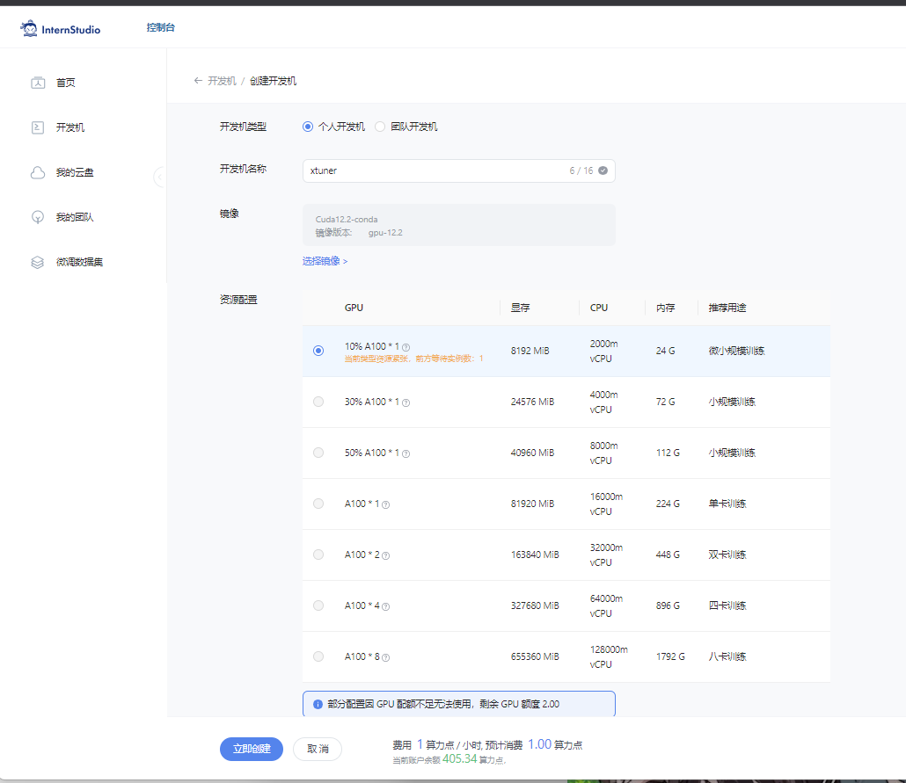

# XTuner 微调个人小助手认知任务

记录复现过程并截图。

## 基础任务（完成此任务即完成闯关并获得 100 算力点）

- 使用 XTuner 微调 InternLM2-Chat-1.8B 实现自己的小助手认知，如下图所示（图中的`伍鲜同志`需替换成自己的昵称），记录复现过程并截图。


### 1. 前期准备
#### 1.1 创建开发机
选用 10%以上 A100, Cuda 12.1开发机，命名为xtuner:


#### 1.2 下载资料
当我们准备好开发机之后，就可以进行下一步的微调任务了。

另外，进入开发机之后，请确保自己已经克隆了Tutorial仓库的资料到本地。

```bash
mkdir -p /root/InternLM/Tutorial
git clone -b camp3  https://github.com/InternLM/Tutorial /root/InternLM/Tutorial
```

#### 1.3 创建虚拟环境
在安装 XTuner 之前，我们需要先创建一个虚拟环境。使用 `Anaconda` 创建一个名为 `xtuner0121` 的虚拟环境，可以直接执行命令。


```bash
# 创建虚拟环境
conda create -n xtuner0121 python=3.10 -y

# 激活虚拟环境（注意：后续的所有操作都需要在这个虚拟环境中进行）
conda activate xtuner0121

# 安装一些必要的库
conda install pytorch==2.1.2 torchvision==0.16.2 torchaudio==2.1.2 pytorch-cuda=12.1 -c pytorch -c nvidia -y
# 安装其他依赖
pip install transformers==4.39.3
pip install streamlit==1.36.0
```


## 进阶任务（闯关不要求完成此任务）

- 用自己感兴趣的知识对基座模型进行增量预训练微调
- 在资源允许的情况下，尝试实现多卡微调与分布式微调
- 将自我认知的模型上传到 OpenXLab，并将应用部署到 OpenXLab

> OpenXLab 部署教程：https://github.com/InternLM/Tutorial/tree/camp2/tools/openxlab-deploy

## 闯关材料提交 (完成任务并且提交材料视为闯关成功)

- 请将作业发布到知乎、CSDN等任一社交媒体，将作业链接提交到以下问卷，助教老师批改后将获得 100 算力点奖励！！！
- 提交地址：https://aicarrier.feishu.cn/share/base/form/shrcnZ4bQ4YmhEtMtnKxZUcf1vd
