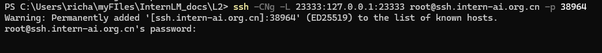

# LMDeploy 量化部署实践闯关任务

## **基础任务（完成此任务即完成闯关）**


- 使用结合W4A16量化与kv cache量化的`internlm2_5-1_8b-chat`模型封装本地API并与大模型进行一次对话，作业截图需包括显存占用情况与大模型回复，参考4.1 API开发(优秀学员必做)，**请注意2.2.3节与4.1节应使用作业版本命令。**
- 使用Function call功能让大模型完成一次简单的"加"与"乘"函数调用，作业截图需包括大模型回复的工具调用情况，参考4.2 Function call(选做)


### 1. 创建开发机
选用 30% A100, Cuda 12.2 (继续使用Lagent创建的开发机即可)


### 2. 配置环境
#### 2.1 创建虚拟环境
进入终端，运行一下代码:

```bash
conda create -n lmdeploy  python=3.10 -y
conda activate lmdeploy
conda install pytorch==2.1.2 torchvision==0.16.2 torchaudio==2.1.2 pytorch-cuda=12.1 -c pytorch -c nvidia -y
pip install timm==1.0.8 openai==1.40.3 lmdeploy[all]==0.5.3
```
#### 2.2 获取模型
创建文件夹并设置开发机共享目录的软链接以访问模型文件:

```bash
mkdir /root/models
ln -s /root/share/new_models/Shanghai_AI_Laboratory/internlm2_5-7b-chat /root/models
ln -s /root/share/new_models/Shanghai_AI_Laboratory/internlm2_5-1_8b-chat /root/models
ln -s /root/share/new_models/OpenGVLab/InternVL2-26B /root/models
```
运行完后，我们可以在`/root/models`中看到`internlm2_5-7b-chat`、`internlm2_5-1_8b-chat`和`InternVL2-26B`文件夹。


我们将选用**internlm2_5-1_8b-chat模型**完成此次量化作业，以加快量化速度。

#### 2.3 LMDeploy验证启动模型文件
让我们进入创建好的conda环境并internlm2_5-1_8b-chat, 启动！

```bash
conda activate lmdeploy
lmdeploy chat /root/models/internlm2_5-1_8b-chat
```

成功启动如下:


我们先测试一下模型的问答功能。在命令行中输入信息在**双击回车**即可提问:


### 3. LMDeploy API部署InternLM2.5
接下来我们来将大模型封装为API接口供客户使用。
#### 3.1.1 启动API服务器
首先让我们进入创建好的conda环境，并通下命令启动API服务器，部署`internlm2_5-1_8b-chat`模型：

```bash
conda activate lmdeploy
lmdeploy serve api_server \
    /root/models/internlm2_5-1_8b-chat \
    --model-format hf \
    --quant-policy 0 \
    --server-name 0.0.0.0 \
    --server-port 23333 \
    --tp 1
```
稍等一会，成功会显示下列信息:


接下来在本地电脑的Powershell或其他命令行上做ssh转发:
```bash
 ssh -CNg -L 23333:127.0.0.1:23333 root@ssh.intern-ai.org.cn -p 38964
```
`38964 换成你的开发机端口`



然后打开浏览器，访问`http://127.0.0.1:23333`看到如下界面即代表部署成功:


#### 3.1.2 以命令行形式连接API服务器
关闭`http://127.0.0.1:23333`网页，但保持终端和本地窗口不动。在开发机上再开一个命令行, 运行如下命令，激活conda环境并启动命令行客户端。

```bash
conda activate lmdeploy
lmdeploy serve api_client http://localhost:23333
```
稍待片刻，等出现`double enter to end input >>>`的输入提示即启动成功，此时便可以随意与InternLM2.5对话，同样是两下回车确定，输入`exit`退出:


#### 3.1.3 以Gradio网页形式连接API服务器
退出模型输入界面，原地输入以下命令，使用Gradio作为前端，启动网页:

```bash
lmdeploy serve gradio http://localhost:23333 \
    --server-name 0.0.0.0 \
    --server-port 6006
```


关闭之前的cmd/powershell窗口，重开一个，再次做一下ssh转发(因为此时端口不同)。在你本地打开一个cmd或powershell窗口，输入命令如下。

```Python
ssh -CNg -L 6006:127.0.0.1:6006 root@ssh.intern-ai.org.cn -p 38964
```
`38964 换成你的开发机端口`

打开浏览器，访问地址`http://127.0.0.1:6006`，然后就可以使用模型了:


#### 3.2 LMDeploy Lite

随着模型变得越来越大，我们需要一些大模型压缩技术来降低模型部署的成本，并提升模型的推理性能。LMDeploy 提供了权重量化和 k/v cache两种策略。

#### 3.2.1 设置最大kv cache缓存大小

kv cache是一种缓存技术，通过存储键值对的形式来复用计算结果，以达到提高性能和降低内存消耗的目的。在大规模训练和推理中，kv cache可以显著减少重复计算量，从而提升模型的推理速度。理想情况下，kv cache全部存储于显存，以加快访存速度。

模型在运行时，占用的显存可大致分为三部分：模型参数本身占用的显存、kv cache占用的显存，以及中间运算结果占用的显存。LMDeploy的kv cache管理器可以通过设置`--cache-max-entry-count`参数，控制kv缓存占用**剩余显存**的最大比例。默认的比例为0.8。

首先我们先来回顾一下在50% A100 开发机中，InternLM2.5正常运行时占用显存。


占用了**34GB**，那么试一试执行以下命令，再来观看占用显存情况。

```bash
lmdeploy chat /root/models/internlm2_5-1_8b-chat --cache-max-entry-count 0.4
```

稍待片刻，观测显存占用情况，可以看到减少了约**15GB**的显存。


#### 3.2.2 设置**在线** kv cache int4/int8 量化

自 v0.4.0 起，LMDeploy 支持在线 kv cache int4/int8 量化，量化方式为 per-head per-token 的非对称量化。此外，通过 LMDeploy 应用 kv 量化非常简单，只需要设定 `quant_policy` 和`cache-max-entry-count`参数。目前，LMDeploy 规定 `quant_policy=4` 表示 kv int4 量化，`quant_policy=8` 表示 kv int8 量化。

我们通过**3. LMDeploy API部署InternLM2.5**的实践为例，输入以下指令，启动API服务器。

```bash
lmdeploy serve api_server \
    /root/models/internlm2_5-7b-chat \
    --model-format hf \
    --quant-policy 4 \
    --cache-max-entry-count 0.4\
    --server-name 0.0.0.0 \
    --server-port 23333 \
    --tp 1
```

稍待片刻，显示如下即代表服务启动成功。


可以看到此时显存占用约**26GB**，相较于直接启动模型的显存占用情况(**34GB**)减少了**8GB**的占用。


#### 3.2.3 W4A16 模型量化和部署

准确说，模型量化是一种优化技术，旨在减少机器学习模型的大小并提高其推理速度。量化通过将模型的权重和激活从高精度（如16位浮点数）转换为低精度（如8位整数、4位整数、甚至二值网络）来实现。

那么标题中的W4A16又是什么意思呢？

- W4：这通常表示权重量化为4位整数（int4）。这意味着模型中的权重参数将从它们原始的浮点表示（例如FP32、BF16或FP16，**Internlm2.5精度为BF16**）转换为4位的整数表示。这样做可以显著减少模型的大小。
- A16：这表示激活（或输入/输出）仍然保持在16位浮点数（例如FP16或BF16）。激活是在神经网络中传播的数据，通常在每层运算之后产生。

因此，W4A16的量化配置意味着：

- 权重被量化为4位整数。
- 激活保持为16位浮点数。

让我们回到LMDeploy，在最新的版本中，LMDeploy使用的是AWQ算法，能够实现模型的4bit权重量化。输入以下指令，执行量化工作。


**完成作业时请使用1.8B模型进行量化：(建议运行以下命令)**

```bash
lmdeploy lite auto_awq \
   /root/models/internlm2_5-1_8b-chat \
  --calib-dataset 'ptb' \
  --calib-samples 128 \
  --calib-seqlen 2048 \
  --w-bits 4 \
  --w-group-size 128 \
  --batch-size 1 \
  --search-scale False \
  --work-dir /root/models/internlm2_5-1_8b-chat-w4a16-4bit
```

等终端输出如下时，说明正在推理中，稍待片刻。


等待推理完成，便可以直接在你设置的目标文件夹看到对应的模型文件。

推理后的模型和原本的模型最明显的两点区别在于模型文件大小以及占据显存大小。

我们可以输入如下指令查看在当前目录中显示所有子目录的大小。

```bash
cd /root/models/
du -sh *
```

输出结果如下。(其余文件夹都是以软链接的形式存在的，不占用空间，故显示为0)


那么原模型大小呢？输入以下指令查看。

```Python
cd /root/share/new_models/Shanghai_AI_Laboratory/
du -sh *
```

终端输出结果如下。


一经对比即可发觉，15G 对 4.9G !!!


#### 3.2.4  W4A16 量化 + KV cache + KV cache 量化
我全都要！
那么运行下列代码，即可享受三项优化策略:
```bash
lmdeploy serve api_server \
    /root/models/internlm2_5-1_8b-chat-w4a16-4bit/ \
    --model-format awq \
    --quant-policy 4 \
    --cache-max-entry-count 0.4\
    --server-name 0.0.0.0 \
    --server-port 23333 \
    --tp 1
```
这下我们终于能完成第一个作业任务了，大模型对话如下:

图片

此处省略 **LMDeploy API部署InternVL2**

进入 **API开发**

### 4. LMDeploy之FastAPI与Function call
在这一章节中我们将依托于LMDeploy封装出来的API进行更加灵活更具DIY的开发。
#### 4.1 API开发

与之前一样，让我们进入创建好的conda环境并输入指令启动API服务器。


**完成作业时请使用以下命令：**

```bash
conda activate lmdeploy
lmdeploy serve api_server \
    /root/models/internlm2_5-1_8b-chat-w4a16-4bit \
    --model-format awq \
    --cache-max-entry-count 0.4 \
    --quant-policy 4 \
    --server-name 0.0.0.0 \
    --server-port 23333 \
    --tp 1
```

保持当前终端窗口不动，新建一个终端。


在新建终端中输入如下指令，新建`internlm2_5.py`。

```bash
touch /root/internlm2_5.py
```

此时我们可以在左侧的File Broswer中看到`internlm2_5.py`文件，双击打开。

将以下内容复制粘贴进`internlm2_5.py`:
```Python
# 导入openai模块中的OpenAI类，这个类用于与OpenAI API进行交互
from openai import OpenAI


# 创建一个OpenAI的客户端实例，需要传入API密钥和API的基础URL
client = OpenAI(
    api_key='YOUR_API_KEY',  
    # 替换为你的OpenAI API密钥，由于我们使用的本地API，无需密钥，任意填写即可
    base_url="http://0.0.0.0:23333/v1"  
    # 指定API的基础URL，这里使用了本地地址和端口
)

# 调用client.models.list()方法获取所有可用的模型，并选择第一个模型的ID
# models.list()返回一个模型列表，每个模型都有一个id属性
model_name = client.models.list().data[0].id

# 使用client.chat.completions.create()方法创建一个聊天补全请求
# 这个方法需要传入多个参数来指定请求的细节
response = client.chat.completions.create(
  model=model_name,  
  # 指定要使用的模型ID
  messages=[  
  # 定义消息列表，列表中的每个字典代表一个消息
    {"role": "system", "content": "你是一个友好的小助手，负责解决问题."},  
    # 系统消息，定义助手的行为
    {"role": "user", "content": "帮我讲述一个关于狐狸和西瓜的小故事"},  
    # 用户消息，询问时间管理的建议
  ],
    temperature=0.8,  
    # 控制生成文本的随机性，值越高生成的文本越随机
    top_p=0.8  
    # 控制生成文本的多样性，值越高生成的文本越多样
)

# 打印出API的响应结果
print(response.choices[0].message.content)
```

按`Ctrl+S`键保存（Mac用户按`Command+S`）。

现在让我们在新建终端输入以下指令激活环境并运行python代码。

```Python
conda activate lmdeploy
python /root/internlm2_5.py
```

终端会输出如下结果。


此时代表我们成功地使用本地API与大模型进行了一次对话，如果切回第一个终端窗口，会看到如下信息，这代表其成功的完成了一次用户问题GET与输出POST。


## **闯关材料提交（完成任务并且提交材料视为闯关成功）**

- 闯关作业总共分为一个任务，一个任务完成视作闯关成功。
- 请将作业发布到知乎、CSDN等任一社交媒体，将作业链接提交到以下问卷，助教老师批改后将获得 50 算力点奖励！！！
- 提交地址：https://aicarrier.feishu.cn/share/base/form/shrcnZ4bQ4YmhEtMtnKxZUcf1vd
