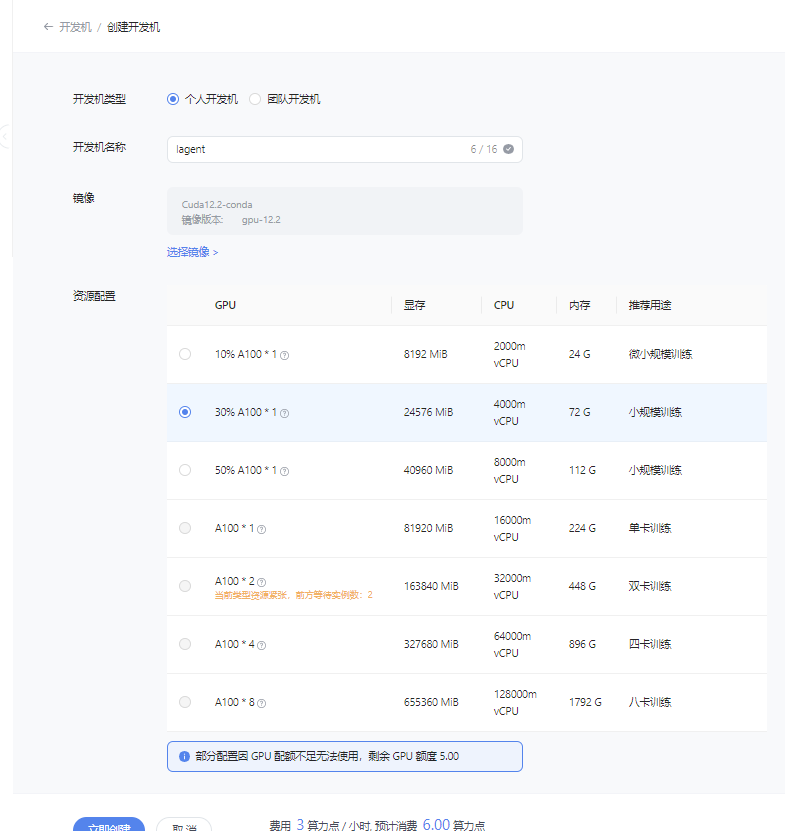
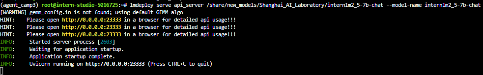
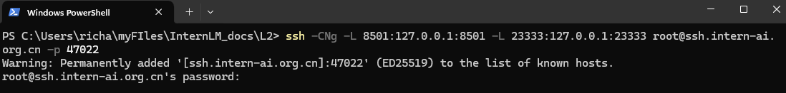
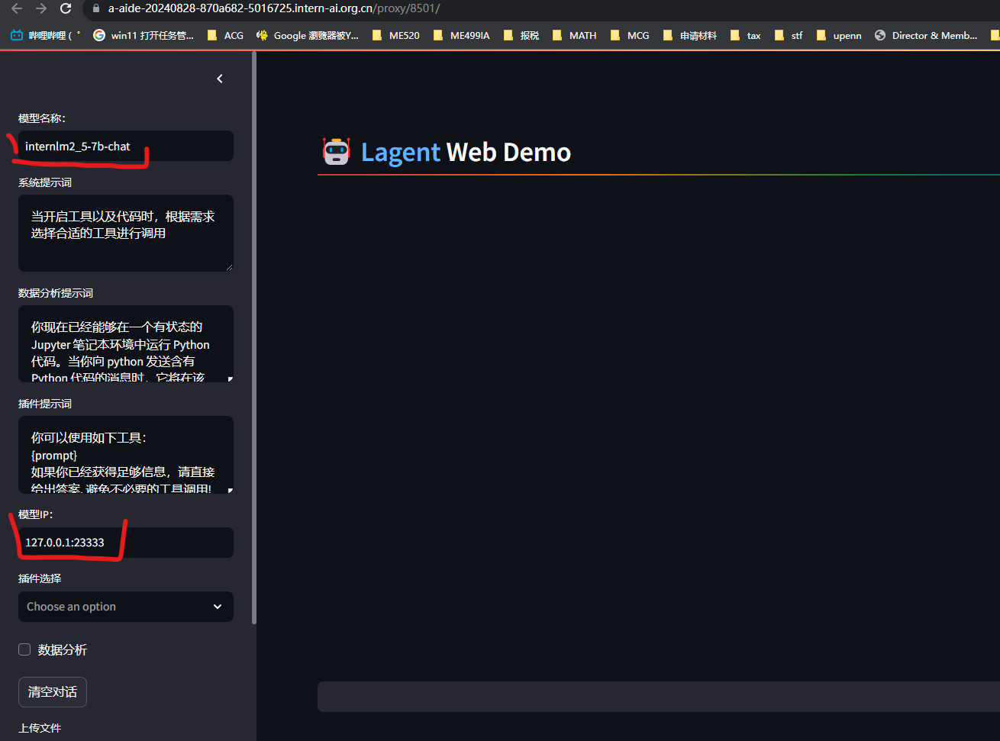
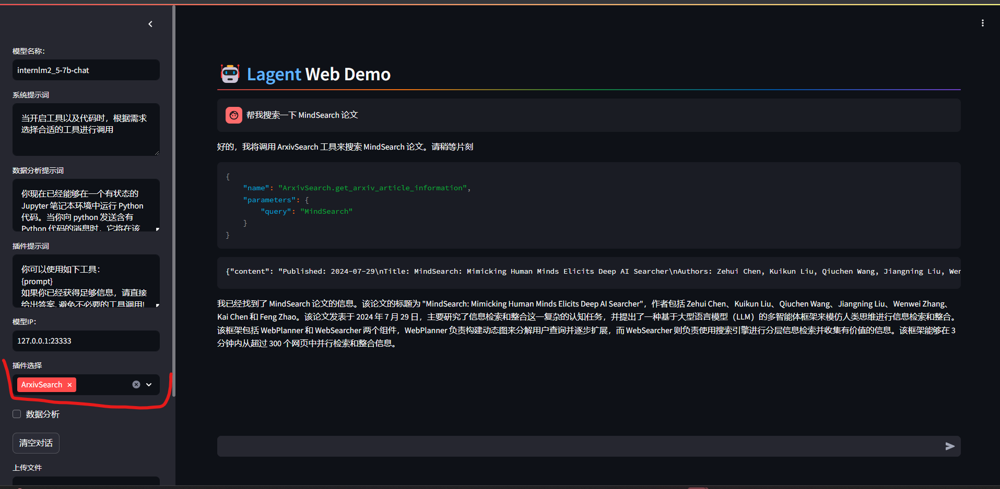
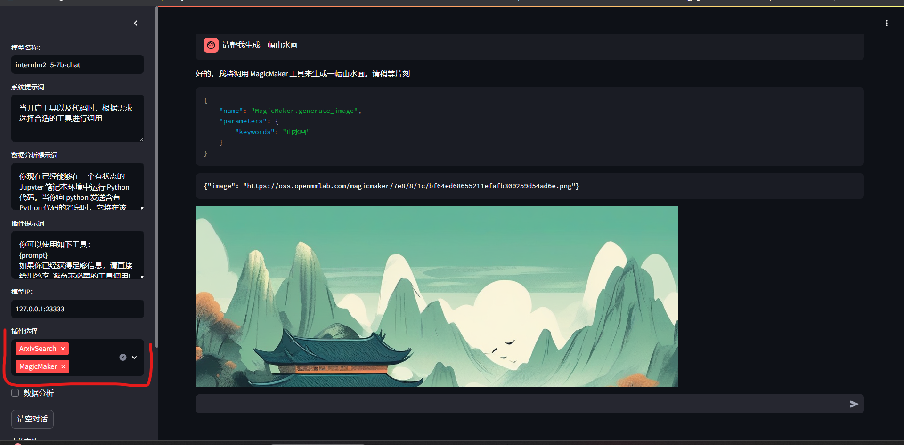
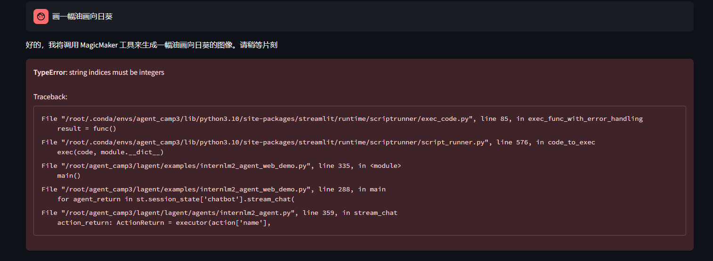

# Lagent 自定义你的 Agent 智能体

记录复现过程并截图

## 基础任务（完成此任务即完成闯关）

- 使用 Lagent 自定义一个智能体，并使用 Lagent Web Demo 成功部署与调用，记录复现过程并截图。


### 1. 前期准备
开发机选择 30% A100，镜像选择为 Cuda12.2-conda, 命名为`lagent`


进入开发机后运行下列代码以配置虚拟环境:
```bash
# 创建环境
conda create -n agent_camp3 python=3.10 -y
# 激活环境
conda activate agent_camp3
# 安装 torch
conda install pytorch==2.1.2 torchvision==0.16.2 torchaudio==2.1.2 pytorch-cuda=12.1 -c pytorch -c nvidia -y
# 安装其他依赖包
pip install termcolor==2.4.0
pip install lmdeploy==0.5.2
```

接下来，我们通过源码安装的方式安装 lagent。

```bash
# 创建目录以存放代码
mkdir -p /root/agent_camp3
cd /root/agent_camp3
git clone https://github.com/InternLM/lagent.git
cd lagent && git checkout 81e7ace && pip install -e . && cd ..
```

### 2. 使用 Lagent 的 Web Demo
做完前期准备后我们选择使用 Lagent 的 Web Demo 来测试 InternLM2.5 7B Chat 智能体的性能。

我们先使用 LMDeploy 部署 InternL3M2.5-7B-Chat，并启动一个 API Server。
```bash
conda activate agent_camp3
lmdeploy serve api_server /share/new_models/Shanghai_AI_Laboratory/internlm2_5-7b-chat --model-name internlm2_5-7b-chat
```



然后，我们在另一个窗口中启动 Lagent 的 Web Demo。

```bash
cd /root/agent_camp3/lagent
conda activate agent_camp3
streamlit run examples/internlm2_agent_web_demo.py
```

demo.png)

在等待两个 server 都完全启动（如下图所示）后，我们在 **本地** 的 PowerShell 中输入如下指令来进行端口映射：

```bash
ssh -CNg -L 8501:127.0.0.1:8501 -L 23333:127.0.0.1:23333 root@ssh.intern-ai.org.cn -p <你的 开发机SSH 端口号>
```



| LMDeploy api_server | Lagent Web Demo | 
| --- | --- |
|  | demo.png) |

接下来，在本地`Chrome`浏览器中打开 `localhost:8501`，(`注意：如果遇到ModuleNotFoundError: No module named 'griffe.enumerations'错误，将 griffe 包版本降到 0.48 即可解决`)并修改**模型名称**一栏为 `internlm2_5-7b-chat`，修改**模型 ip**一栏为`127.0.0.1:23333`:



然后，我们在插件选择一栏选择 `ArxivSearch`，并输入指令“帮我搜索一下 MindSearch 论文”, 模型回复结果如下:




### 3. 基于 Lagent 自首先，我们先来创建工具文件：

接下来让我们调用 MagicMaker API 实现文字生成图片的功能。首先，我们先来创建工具文件：
```bash
cd /root/agent_camp3/lagent
touch lagent/actions/magicmaker.py
```
然后我们把下列代码写入`magicmaker.py`:

```python
import json
import requests

from lagent.actions.base_action import BaseAction, tool_api
from lagent.actions.parser import BaseParser, JsonParser
from lagent.schema import ActionReturn, ActionStatusCode


class MagicMaker(BaseAction):
    styles_option = [
        'dongman',  # 动漫
        'guofeng',  # 国风
        'xieshi',   # 写实
        'youhua',   # 油画
        'manghe',   # 盲盒
    ]
    aspect_ratio_options = [
        '16:9', '4:3', '3:2', '1:1',
        '2:3', '3:4', '9:16'
    ]

    def __init__(self,
                 style='guofeng',
                 aspect_ratio='4:3'):
        super().__init__()
        if style in self.styles_option:
            self.style = style
        else:
            raise ValueError(f'The style must be one of {self.styles_option}')
        
        if aspect_ratio in self.aspect_ratio_options:
            self.aspect_ratio = aspect_ratio
        else:
            raise ValueError(f'The aspect ratio must be one of {aspect_ratio}')
    
    @tool_api
    def generate_image(self, keywords: str) -> dict:
        """Run magicmaker and get the generated image according to the keywords.

        Args:
            keywords (:class:`str`): the keywords to generate image

        Returns:
            :class:`dict`: the generated image
                * image (str): path to the generated image
        """
        try:
            response = requests.post(
                url='https://magicmaker.openxlab.org.cn/gw/edit-anything/api/v1/bff/sd/generate',
                data=json.dumps({
                    "official": True,
                    "prompt": keywords,
                    "style": self.style,
                    "poseT": False,
                    "aspectRatio": self.aspect_ratio
                }),
                headers={'content-type': 'application/json'}
            )
        except Exception as exc:
            return ActionReturn(
                errmsg=f'MagicMaker exception: {exc}',
                state=ActionStatusCode.HTTP_ERROR)
        image_url = response.json()['data']['imgUrl']
        return {'image': image_url}

```
最后，我们修改 `/root/agent_camp3/lagent/examples/internlm2_agent_web_demo.py` 来适配我们的自定义工具。

1. 在 `from lagent.actions import ActionExecutor, ArxivSearch, IPythonInterpreter` 的下一行添加 `from lagent.actions.magicmaker import MagicMaker`
2. 在第27行添加 `MagicMaker()`。

```diff
from lagent.actions import ActionExecutor, ArxivSearch, IPythonInterpreter
+ from lagent.actions.magicmaker import MagicMaker
from lagent.agents.internlm2_agent import INTERPRETER_CN, META_CN, PLUGIN_CN, Internlm2Agent, Internlm2Protocol

...
        action_list = [
            ArxivSearch(),
+             MagicMaker(),
        ]
```

接下来，我们同时启用两个工具，然后输入“请帮我生成一幅山水画”:



要它画别的就歇菜了:



## 闯关材料提交（完成任务并且提交材料视为闯关成功）

- 闯关作业总共分为一个任务，一个任务完成视作闯关成功。
- 请将作业发布到知乎、CSDN等任一社交媒体，将作业链接提交到以下问卷，助教老师批改后将获得 100 算力点奖励！！！ 
- 提交地址：https://aicarrier.feishu.cn/share/base/form/shrcnZ4bQ4YmhEtMtnKxZUcf1vd
